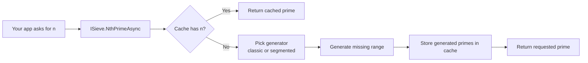

# 00 - How To Use Sieve in Another Codebase

## Who This Is For
This guide is for developers integrating this library into a different .NET codebase and exposing the prime API through `Sieve.Core.Abstractions.ISieve`.

## What This Library Gives You
- A thread-safe prime service via `ISieve`
- Two API styles:
  - `NthPrime(long n)` for synchronous callers
  - `NthPrimeAsync(long n, CancellationToken)` for async/cancellable callers
- Built-in DI registration via `AddSieveServices(...)`
- Caching + strategy switching handled internally by `SieveOrchestrator`

## The Flow (End to End)


## Indexing Rule (Important)
This API is zero-based.
- `n = 0` returns `2`
- `n = 1` returns `3`
- `n = 19` returns `71`

If you treat `n` as one-based, your results will be off by one.

## Quick Start: ASP.NET Core (Recommended)
Use this when your app already uses dependency injection.

### 1) Add project references (or NuGet packages)
At minimum, your app needs access to:
- `Sieve.Core`
- `Sieve.Extensions`

### 2) Register Sieve services
```csharp
using Sieve.Extensions;

var builder = WebApplication.CreateBuilder(args);

builder.Services.AddSieveServices(options =>
{
    options.MaxCacheMemoryBytes = 200L * 1024 * 1024; // 200 MB
    options.CacheChunkSize = 20_000;
    options.SegmentSize = 2 * 1024 * 1024;
});

var app = builder.Build();
```

### 3) Inject and use `ISieve`
```csharp
using Microsoft.AspNetCore.Mvc;
using Sieve.Core.Abstractions;

[ApiController]
[Route("api/primes")]
public sealed class PrimesController : ControllerBase
{
    private readonly ISieve _sieve;

    public PrimesController(ISieve sieve)
    {
        _sieve = sieve;
    }

    [HttpGet("{n:long}")]
    public async Task<ActionResult<long>> GetNthPrime(long n, CancellationToken ct)
    {
        try
        {
            var prime = await _sieve.NthPrimeAsync(n, ct);
            return Ok(prime);
        }
        catch (ArgumentOutOfRangeException)
        {
            return BadRequest("n must be >= 0 (zero-based index).");
        }
    }
}
```

## Example: Console App with DI
Use this for batch jobs, CLIs, and scripts.

```csharp
using Microsoft.Extensions.DependencyInjection;
using Sieve.Core.Abstractions;
using Sieve.Extensions;

var services = new ServiceCollection();
services.AddSieveServices();

using var provider = services.BuildServiceProvider();
var sieve = provider.GetRequiredService<ISieve>();

Console.WriteLine(sieve.NthPrime(99)); // 541
```

## Example: Background Worker
Use async + cancellation in long-running services.

```csharp
using Microsoft.Extensions.Hosting;
using Microsoft.Extensions.Logging;
using Sieve.Core.Abstractions;

public sealed class PrimeWorker : BackgroundService
{
    private readonly ISieve _sieve;
    private readonly ILogger<PrimeWorker> _logger;

    public PrimeWorker(ISieve sieve, ILogger<PrimeWorker> logger)
    {
        _sieve = sieve;
        _logger = logger;
    }

    protected override async Task ExecuteAsync(CancellationToken stoppingToken)
    {
        var n = 1_000_000L;
        var prime = await _sieve.NthPrimeAsync(n, stoppingToken);
        _logger.LogInformation("Prime({N}) = {Prime}", n, prime);
    }
}
```

## Example: Legacy/No-DI Compatibility Path
If your app does not have DI, you can use the compatibility facade in the `Sieve` project.

```csharp
using Sieve;

ISieve sieve = SieveFactory.Create();
var value = sieve.NthPrime(19); // 71
Console.WriteLine(value);
```

Note: this `Sieve.ISieve` is a compatibility interface with only the synchronous method.

## Example: Use `ISieve` as an App Boundary (Clean Architecture)
Create your own adapter/service and keep prime logic behind your application interface.

```csharp
using Sieve.Core.Abstractions;

public interface IPrimeLookup
{
    Task<long> GetByZeroBasedIndexAsync(long index, CancellationToken ct);
}

public sealed class PrimeLookup : IPrimeLookup
{
    private readonly ISieve _sieve;

    public PrimeLookup(ISieve sieve)
    {
        _sieve = sieve;
    }

    public Task<long> GetByZeroBasedIndexAsync(long index, CancellationToken ct)
        => _sieve.NthPrimeAsync(index, ct);
}
```

## Pros and Cons

### Pros
- Thread-safe contract for concurrent server workloads
- Caching improves repeated and nearby requests
- Async API supports cancellation
- Registration is one line with `AddSieveServices(...)`
- Clear exception contract for input vs computation failures

### Cons
- More moving parts than a minimal one-file implementation
- First large request can be expensive before cache warms
- Synchronous API can block calling threads
- Requires understanding zero-based indexing to avoid caller mistakes

## Pitfalls and Warnings

1. Off-by-one mistakes
Use zero-based indexing everywhere. Validate request contracts explicitly in your own API.

2. Choosing sync in request threads
Prefer `NthPrimeAsync` in web and worker services. Use `NthPrime` only when you intentionally want blocking behavior.

3. Ignoring cancellation
Pass `HttpContext.RequestAborted` (or an equivalent token) so abandoned requests stop expensive computation.

4. Namespace collision between interfaces named `ISieve`
There are two interfaces:
- `Sieve.Core.Abstractions.ISieve` (full contract, recommended)
- `Sieve.ISieve` (compatibility facade)

If needed, alias one:
```csharp
using CoreSieve = Sieve.Core.Abstractions.ISieve;
```

5. Cache/memory tuning
Defaults are safe for many cases, but high-throughput services may need configuration tuning for memory budget and segment size.

## Error Handling Pattern (Recommended)
```csharp
try
{
    var prime = await sieve.NthPrimeAsync(n, ct);
}
catch (ArgumentOutOfRangeException)
{
    // Caller bug / invalid input.
}
catch (OperationCanceledException)
{
    // Expected cancellation path.
}
catch (Sieve.Core.Exceptions.PrimeComputationException ex)
{
    // Unexpected computation failure. Check ex.InnerException.
}
```

## Integration Checklist
- Confirm all callers treat `n` as zero-based
- Prefer `NthPrimeAsync` in server code
- Pass cancellation tokens end-to-end
- Register via `AddSieveServices(...)`
- Tune cache/segment options for production traffic patterns
- Add at least one integration test for known values (`0 -> 2`, `19 -> 71`, `99 -> 541`)

## Minimal Smoke Test
```csharp
using Sieve.Core.Abstractions;

var expected = new Dictionary<long, long>
{
    [0] = 2,
    [19] = 71,
    [99] = 541
};

foreach (var pair in expected)
{
    var actual = await sieve.NthPrimeAsync(pair.Key, CancellationToken.None);
    if (actual != pair.Value)
    {
        throw new Exception($"Prime mismatch at index {pair.Key}: expected {pair.Value}, got {actual}");
    }
}
```
