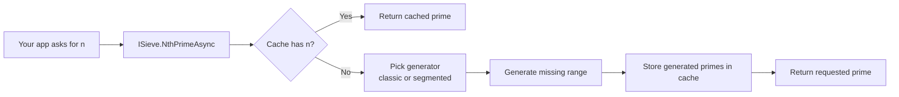

# 00 - How To Use Sieve in Another Codebase

## Who This Is For
This guide is for developers integrating this library into a different .NET codebase and exposing the prime API through `Sieve.Core.Abstractions.ISieve`.

## What This Library Gives You
- A thread-safe prime service via `ISieve`
- Two API styles:
  - `NthPrime(long n)` for synchronous callers
  - `NthPrimeAsync(long n, CancellationToken)` for async/cancellable callers
- Built-in DI registration via `AddSieveServices(...)`
- Caching + strategy switching handled internally by `SieveOrchestrator`

## The Flow (End to End)


## Indexing Rule (Important)
This API is zero-based.
- `n = 0` returns `2`
- `n = 1` returns `3`
- `n = 19` returns `71`

If you treat `n` as one-based, your results will be off by one.

## Quick Start: ASP.NET Core (Recommended)
Use this when your app already uses dependency injection.

### 1) Add project references (or NuGet packages)
At minimum, your app needs access to:
- `Sieve.Core`
- `Sieve.Extensions`

### 2) Register Sieve services
```csharp
using Sieve.Extensions;

var builder = WebApplication.CreateBuilder(args);

builder.Services.AddSieveServices(options =>
{
    options.MaxCacheMemoryBytes = 200L * 1024 * 1024; // 200 MB
    options.CacheChunkSize = 20_000;
    options.SegmentSize = 2 * 1024 * 1024;
});

var app = builder.Build();
```

### 3) Inject and use `ISieve`
```csharp
using Microsoft.AspNetCore.Mvc;
using Sieve.Core.Abstractions;

[ApiController]
[Route("api/primes")]
public sealed class PrimesController : ControllerBase
{
    private readonly ISieve _sieve;

    public PrimesController(ISieve sieve)
    {
        _sieve = sieve;
    }

    [HttpGet("{n:long}")]
    public async Task<ActionResult<long>> GetNthPrime(long n, CancellationToken ct)
    {
        try
        {
            var prime = await _sieve.NthPrimeAsync(n, ct);
            return Ok(prime);
        }
        catch (ArgumentOutOfRangeException)
        {
            return BadRequest("n must be >= 0 (zero-based index).");
        }
    }
}
```

## Example: Console App with DI
Use this for batch jobs, CLIs, and scripts.

```csharp
using Microsoft.Extensions.DependencyInjection;
using Sieve.Core.Abstractions;
using Sieve.Extensions;

var services = new ServiceCollection();
services.AddSieveServices();

using var provider = services.BuildServiceProvider();
var sieve = provider.GetRequiredService<ISieve>();

Console.WriteLine(sieve.NthPrime(99)); // 541
```

## Example: Background Worker
Use async + cancellation in long-running services.

```csharp
using Microsoft.Extensions.Hosting;
using Microsoft.Extensions.Logging;
using Sieve.Core.Abstractions;

public sealed class PrimeWorker : BackgroundService
{
    private readonly ISieve _sieve;
    private readonly ILogger<PrimeWorker> _logger;

    public PrimeWorker(ISieve sieve, ILogger<PrimeWorker> logger)
    {
        _sieve = sieve;
        _logger = logger;
    }

    protected override async Task ExecuteAsync(CancellationToken stoppingToken)
    {
        var n = 1_000_000L;
        var prime = await _sieve.NthPrimeAsync(n, stoppingToken);
        _logger.LogInformation("Prime({N}) = {Prime}", n, prime);
    }
}
```

## Example: Legacy/No-DI Compatibility Path
If your app does not have DI, you can use the compatibility facade in the `Sieve` project.

```csharp
using Sieve;

ISieve sieve = SieveFactory.Create();
var value = sieve.NthPrime(19); // 71
Console.WriteLine(value);
```

Note: this `Sieve.ISieve` is a compatibility interface with only the synchronous method.

## Example: Use `ISieve` as an App Boundary (Clean Architecture)
Create your own adapter/service and keep prime logic behind your application interface.

```csharp
using Sieve.Core.Abstractions;

public interface IPrimeLookup
{
    Task<long> GetByZeroBasedIndexAsync(long index, CancellationToken ct);
}

public sealed class PrimeLookup : IPrimeLookup
{
    private readonly ISieve _sieve;

    public PrimeLookup(ISieve sieve)
    {
        _sieve = sieve;
    }

    public Task<long> GetByZeroBasedIndexAsync(long index, CancellationToken ct)
        => _sieve.NthPrimeAsync(index, ct);
}
```

## Pros and Cons

### Pros
- Thread-safe contract for concurrent server workloads
- Caching improves repeated and nearby requests
- Async API supports cancellation
- Registration is one line with `AddSieveServices(...)`
- Clear exception contract for input vs computation failures

### Cons
- More moving parts than a minimal one-file implementation
- First large request can be expensive before cache warms
- Synchronous API can block calling threads
- Requires understanding zero-based indexing to avoid caller mistakes

## Pitfalls and Warnings

1. Off-by-one mistakes
Use zero-based indexing everywhere. Validate request contracts explicitly in your own API.

2. Choosing sync in request threads
Prefer `NthPrimeAsync` in web and worker services. Use `NthPrime` only when you intentionally want blocking behavior.

3. Ignoring cancellation
Pass `HttpContext.RequestAborted` (or an equivalent token) so abandoned requests stop expensive computation.

4. Namespace collision between interfaces named `ISieve`
There are two interfaces:
- `Sieve.Core.Abstractions.ISieve` (full contract, recommended)
- `Sieve.ISieve` (compatibility facade)

If needed, alias one:
```csharp
using CoreSieve = Sieve.Core.Abstractions.ISieve;
```

5. Cache/memory tuning
Defaults are safe for many cases, but high-throughput services may need configuration tuning for memory budget and segment size.

## Benchmark Project: Complete Guide

This repository includes a dedicated BenchmarkDotNet project for performance analysis:
- Project: `csharp/tests/Sieve.Benchmarks`
- Entry point: `csharp/tests/Sieve.Benchmarks/Program.cs`
- Framework: `net8.0`
- Benchmark package: `BenchmarkDotNet 0.14.0`

### What the benchmark measures

The benchmark intentionally measures two very different usage modes:

1. Cold lookup
- Creates a new `SieveImplementation` each invocation.
- Measures first-hit behavior: construction, generation, cache population, and lookup.

2. Warm cache lookup
- Reuses one pre-warmed `SieveImplementation` prepared in `GlobalSetup`.
- Measures fast-path cached lookup cost after warm-up.

Parameter sweep:
- `Index = 2,000`
- `Index = 100,000`
- `Index = 1,000,000`

Total benchmarks per run: 6 (2 methods x 3 index values).

### Internal execution flow for one run

1. BenchmarkDotNet builds an isolated benchmark executable in Release mode.
2. `GlobalSetup` runs once per parameter combination and warms `_warmSieve` for the warm benchmark.
3. For each benchmark method, BenchmarkDotNet performs pilot, warmup, and measured iterations.
4. Results are summarized by method/parameter pair.
5. Reports and logs are written to `csharp/BenchmarkDotNet.Artifacts`.

### How to run

From repository root:
```bash
dotnet run -c Release --project csharp/tests/Sieve.Benchmarks
```

From `csharp` directory:
```bash
dotnet run -c Release --project tests/Sieve.Benchmarks
```

Run only warm benchmark:
```bash
dotnet run -c Release --project tests/Sieve.Benchmarks -- --filter "*Warm*"
```

Run only cold benchmark:
```bash
dotnet run -c Release --project tests/Sieve.Benchmarks -- --filter "*Cold*"
```

### Where results are written

Primary output folder:
- `csharp/BenchmarkDotNet.Artifacts`

Important files:
- `results/Sieve.Benchmarks.SievePerformanceBenchmarks-report-github.md`
- `results/Sieve.Benchmarks.SievePerformanceBenchmarks-report.html`
- `Sieve.Benchmarks.SievePerformanceBenchmarks-<timestamp>.log`

Note: `BenchmarkDotNet.Artifacts/` is ignored by git in `csharp/.gitignore`, which is expected.

### How to read the summary table

Columns you should focus on:

- `Method`
    - Benchmark case name. Here: `Cold lookup` or `Warm cache lookup`.

- `Index`
    - Input size (the nth prime index, 0-based).

- `Mean`
    - Average time per operation. This is your main throughput/latency number.

- `Error` and `StdDev`
    - Run-to-run variability. Lower is better. High variance means noisy environment or unstable workload.

- `Allocated`
    - Managed bytes allocated per operation. This is crucial for pressure on GC.

- `Gen0`, `Gen1`, `Gen2`
    - Garbage collections per 1000 operations (BenchmarkDotNet format). Rising Gen1/Gen2 is a strong signal of heavier memory churn.

### How to interpret expected results for this project

Based on the latest generated report in this repo:

- Warm cache lookup is approximately 94-99 ns across all tested indices.
- Warm cache allocated memory is approximately 192 B per operation.
- Cold lookup scales with index size:
    - Index 2,000: about 6.6 ms, about 197 KB allocated.
    - Index 100,000: about 19.4 ms, about 6.49 MB allocated.
    - Index 1,000,000: about 60.2 ms, about 35.7 MB allocated.

What this means:
- Warm path is effectively constant-time for these tested sizes because lookup is served from cache.
- Cold path cost increases with index as expected due to generation work and memory usage.
- This benchmark confirms a large performance gap between cold and warm usage, which is expected and desired.

### Expected qualitative behavior

You should generally expect:

1. `Warm cache lookup` faster than `Cold lookup` by orders of magnitude.
2. Warm timings in nanoseconds (or very low microseconds depending on machine).
3. Cold timings in milliseconds, increasing as `Index` increases.
4. Cold allocations and GC counts increasing with `Index`.

If you see the opposite trend, treat it as suspicious and investigate environment or code changes.

### Practical analysis checklist

1. Verify method ordering
- `Warm cache lookup` should be fastest.

2. Check scaling
- Cold `Mean` at 1,000,000 should be clearly higher than at 2,000.

3. Check allocation profile
- Warm should stay tiny and stable.
- Cold should grow with index.

4. Check variance
- Large `StdDev` relative to `Mean` suggests noisy benchmark conditions.

5. Compare against previous report
- Regressions should be discussed in percentage terms for both time and memory.

### Common pitfalls when benchmarking

1. Running Debug builds
- Always use `-c Release`.

2. Measuring on a busy machine
- Background load, browser tabs, updates, and thermal throttling can distort results.

3. Mixing cold and warm expectations
- Do not compare cold and warm as if they are equivalent production scenarios.

4. Ignoring memory metrics
- A small speed gain with much larger allocation can still be a net loss under load.

5. Interpreting a single run as definitive
- Run at least 2-3 times and compare trend consistency.

### Troubleshooting notes

- Log line: `Unable to find .sln or .csproj file. Will use current directory ...`
    - Usually harmless in BenchmarkDotNet isolated build flow.
    - If build still succeeds and benchmarks run, no action is needed.

- If benchmark takes too long
    - Use filter to run only one method first (`*Warm*` or `*Cold*`).

- If results seem unstable
    - Re-run after closing heavy applications and keeping power mode on High Performance.

### Recommended workflow for code changes

1. Run benchmarks before your optimization.
2. Save the generated report files outside ignored artifacts if you need versioned history.
3. Make the change.
4. Run the same benchmark command again.
5. Compare `Mean`, `Allocated`, and GC columns side by side.
6. Accept the change only if latency and memory trade-offs are acceptable for your workload.

## Error Handling Pattern (Recommended)
```csharp
try
{
    var prime = await sieve.NthPrimeAsync(n, ct);
}
catch (ArgumentOutOfRangeException)
{
    // Caller bug / invalid input.
}
catch (OperationCanceledException)
{
    // Expected cancellation path.
}
catch (Sieve.Core.Exceptions.PrimeComputationException ex)
{
    // Unexpected computation failure. Check ex.InnerException.
}
```

## Integration Checklist
- Confirm all callers treat `n` as zero-based
- Prefer `NthPrimeAsync` in server code
- Pass cancellation tokens end-to-end
- Register via `AddSieveServices(...)`
- Tune cache/segment options for production traffic patterns
- Add at least one integration test for known values (`0 -> 2`, `19 -> 71`, `99 -> 541`)

## Minimal Smoke Test
```csharp
using Sieve.Core.Abstractions;

var expected = new Dictionary<long, long>
{
    [0] = 2,
    [19] = 71,
    [99] = 541
};

foreach (var pair in expected)
{
    var actual = await sieve.NthPrimeAsync(pair.Key, CancellationToken.None);
    if (actual != pair.Value)
    {
        throw new Exception($"Prime mismatch at index {pair.Key}: expected {pair.Value}, got {actual}");
    }
}
```
