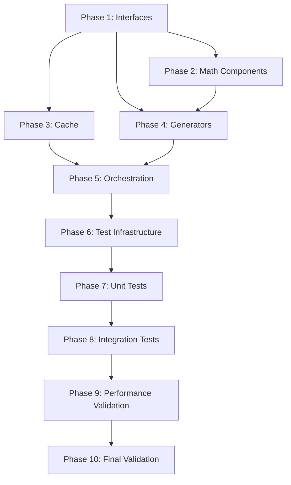

# Implementation Plan
## Nth Prime API - Phased Implementation Roadmap

---

## Table of Contents
1. [Executive Summary](#executive-summary)
2. [Phase 1: Foundation - Core Interfaces & Abstractions](#phase-1-foundation---core-interfaces--abstractions)
3. [Phase 2: Mathematical Components](#phase-2-mathematical-components)
4. [Phase 3: Caching Infrastructure](#phase-3-caching-infrastructure)
5. [Phase 4: Prime Generation Engines](#phase-4-prime-generation-engines)
6. [Phase 5: Orchestration Layer](#phase-5-orchestration-layer)
7. [Phase 6: Test Infrastructure](#phase-6-test-infrastructure)
8. [Phase 7: Unit Testing](#phase-7-unit-testing)
9. [Phase 8: Integration & Functional Testing](#phase-8-integration--functional-testing)
10. [Phase 9: Performance Optimization & Validation](#phase-9-performance-optimization--validation)
11. [Phase 10: Final Validation & Documentation](#phase-10-final-validation--documentation)
12. [Risk Assessment & Mitigation](#risk-assessment--mitigation)
13. [Timeline & Resource Estimates](#timeline--resource-estimates)

---

## Executive Summary

### Implementation Overview

This implementation plan breaks down the construction of the enterprise-grade Nth Prime API into **10 distinct phases**, each building upon the previous to ensure a solid, testable, and maintainable codebase.

**Total Estimated Duration**: 8-12 working days for a senior C# engineer  
**Overall Confidence**: **92%** successful implementation

### Success Criteria

✅ **Functional Requirements (from README.md)**:
- 0-based indexing where 0th prime = 2
- Pass all required test cases: f(0)=2, f(19)=71, f(99)=541, f(500)=3581, f(986)=7793, f(2000)=17393, f(1M)=15,485,867, f(10M)=179,424,691
- Test command `dotnet test Sieve.Tests` executes successfully
- Solution on main branch with no uncommitted changes

✅ **Non-Functional Requirements (from /docs/)**:
- Performance: NthPrime(10M) < 10s first call, < 1ms cached
- Memory: < 500MB peak usage
- Thread safety: All components safe for concurrent access
- Code quality: SOLID principles, design patterns, > 90% test coverage

### Phase Dependencies



---

## Phase 1: Foundation - Core Interfaces & Abstractions

### 🎯 Phase Goals

Establish the contract layer that defines how all components interact. This phase creates the foundation for dependency injection, testability, and SOLID principles.

**Reference Documentation**: 
- [01-architecture-design.md](01-architecture-design.md) - Section 3: Design Patterns (lines 200-400)
- [02-implementation-details.md](02-implementation-details.md) - Section 4.1: Interface Contracts (lines 200-300)

### 📋 Detailed Steps

#### Step 1.1: Create Project Structure (30 minutes)
1. Create solution file: `Sieve.sln`
2. Create projects:
   - `Sieve.Core` (class library) - interfaces and contracts
   - `Sieve.Implementation` (class library) - concrete implementations
   - `Sieve.Extensions` (class library) - DI extensions
   - `Sieve` (existing) - public API facade
   - `Sieve.Tests.Unit` (xUnit test project)
   - `Sieve.Tests.Integration` (xUnit test project)
   - `Sieve.Benchmarks` (console app with BenchmarkDotNet)

**Success Criteria**: All projects build successfully, solution loads in Visual Studio/Rider

#### Step 1.2: Define ISieve Interface (15 minutes)
```csharp
// File: Sieve.Core/Abstractions/ISieve.cs
namespace Sieve.Core.Abstractions;

/// <summary>
/// Primary interface for retrieving the Nth prime number using 0-based indexing.
/// Thread-safe: Yes - all implementations must support concurrent access.
/// </summary>
public interface ISieve
{
    /// <summary>
    /// Retrieves the Nth prime number (0-indexed).
    /// </summary>
    /// <param name="n">Zero-based index (0 returns 2, 1 returns 3, etc.)</param>
    /// <returns>The Nth prime number</returns>
    /// <exception cref="ArgumentOutOfRangeException">If n &lt; 0</exception>
    /// <exception cref="PrimeComputationException">If computation fails</exception>
    long NthPrime(long n);
    
    /// <summary>
    /// Asynchronous version supporting cancellation.
    /// </summary>
    Task<long> NthPrimeAsync(long n, CancellationToken cancellationToken = default);
}
```

**Success Criteria**: ISieve interface compiles with XML documentation

#### Step 1.3: Define IPrimeGenerator Interface (20 minutes)
```csharp
// File: Sieve.Core/Abstractions/IPrimeGenerator.cs
namespace Sieve.Core.Abstractions;

/// <summary>
/// Strategy interface for different prime generation algorithms.
/// Implements Strategy Pattern for algorithm selection.
/// </summary>
public interface IPrimeGenerator
{
    /// <summary>
    /// Generates primes from startIndex to endIndex (inclusive).
    /// </summary>
    /// <param name="startIndex">Starting index (0-based)</param>
    /// <param name="endIndex">Ending index (0-based, inclusive)</param>
    /// <param name="cancellationToken">Cancellation token</param>
    /// <returns>Array of primes in the specified range</returns>
    Task<long[]> GeneratePrimesAsync(
        long startIndex, 
        long endIndex, 
        CancellationToken cancellationToken = default);
    
    /// <summary>
    /// Estimates memory usage for generating primes up to limit.
    /// </summary>
    long EstimateMemoryUsage(long limit);
}
```

**Success Criteria**: IPrimeGenerator interface compiles with clear contracts

#### Step 1.4: Define IPrimeCache Interface (20 minutes)
```csharp
// File: Sieve.Core/Abstractions/IPrimeCache.cs
namespace Sieve.Core.Abstractions;

/// <summary>
/// Repository pattern interface for caching computed primes.
/// Thread-safe: Yes - implementations must handle concurrent access.
/// </summary>
public interface IPrimeCache
{
    /// <summary>
    /// Attempts to retrieve primes from startIndex to endIndex.
    /// </summary>
    /// <returns>True if all primes in range are cached, false otherwise</returns>
    bool TryGetPrimeRange(long startIndex, long endIndex, out long[] primes);
    
    /// <summary>
    /// Stores a contiguous range of primes starting at startIndex.
    /// </summary>
    void AddPrimeRange(long startIndex, ReadOnlySpan<long> primes);
    
    /// <summary>
    /// Gets the highest cached prime index.
    /// </summary>
    long GetHighestCachedIndex();
    
    /// <summary>
    /// Retrieves cache performance statistics.
    /// </summary>
    CacheStatistics GetStatistics();
}
```

**Success Criteria**: IPrimeCache interface compiles with Repository pattern semantics

#### Step 1.5: Define IEstimator Interface (15 minutes)
```csharp
// File: Sieve.Core/Abstractions/IEstimator.cs
namespace Sieve.Core.Abstractions;

/// <summary>
/// Interface for estimating upper bounds for the Nth prime.
/// Used to size data structures appropriately.
/// </summary>
public interface IEstimator
{
    /// <summary>
    /// Estimates an upper bound for the Nth prime number.
    /// Uses Rosser-Schoenfeld inequality: p(n) &lt; n(ln(n) + ln(ln(n))) for n≥6
    /// </summary>
    /// <param name="n">Prime index (0-based)</param>
    /// <returns>Upper bound estimate</returns>
    long EstimateUpperBound(long n);
}
```

**Success Criteria**: IEstimator interface compiles with mathematical documentation

#### Step 1.6: Define Exception Hierarchy (25 minutes)
```csharp
// File: Sieve.Core/Exceptions/SieveException.cs
namespace Sieve.Core.Exceptions;

/// <summary>
/// Base exception for all Sieve-related errors.
/// </summary>
public class SieveException : Exception
{
    public SieveException(string message) : base(message) { }
    public SieveException(string message, Exception innerException) 
        : base(message, innerException) { }
}

/// <summary>
/// Thrown when prime computation fails due to algorithm errors.
/// </summary>
public class PrimeComputationException : SieveException
{
    public long RequestedIndex { get; }
    
    public PrimeComputationException(long requestedIndex, string message) 
        : base(message)
    {
        RequestedIndex = requestedIndex;
    }
}

/// <summary>
/// Thrown when input validation fails.
/// </summary>
public class PrimeValidationException : SieveException
{
    public PrimeValidationException(string message) : base(message) { }
}
```

**Success Criteria**: Exception hierarchy compiles with proper inheritance

#### Step 1.7: Define Models (20 minutes)
```csharp
// File: Sieve.Core/Models/CacheStatistics.cs
namespace Sieve.Core.Models;

/// <summary>
/// Immutable snapshot of cache performance metrics.
/// </summary>
public sealed record CacheStatistics
{
    public long TotalRequests { get; init; }
    public long CacheHits { get; init; }
    public long CacheMisses { get; init; }
    public double HitRatio => TotalRequests > 0 
        ? (double)CacheHits / TotalRequests 
        : 0.0;
    public long EntriesCount { get; init; }
    public long MemoryUsageBytes { get; init; }
}
```

**Success Criteria**: Models compile with C# 10+ record types

### 🔗 Dependencies
- None (foundation phase)

### ⚠️ Risks
- **Low Risk**: Interface design is well-defined in documentation
- Mitigation: Follow documented contracts exactly

### ✅ Phase Completion Criteria
- [ ] All 7 interface files created and compile successfully
- [ ] Exception hierarchy implemented with proper inheritance
- [ ] Models implemented using immutable record types
- [ ] All XML documentation comments complete
- [ ] Zero compiler warnings or errors
- [ ] Projects added to solution and build succeeds

### 📊 Confidence Assessment

**Confidence Level**: **98%**

**Reasoning**:
1. ✅ **Well-Defined Contracts**: All interfaces are fully documented in [02-implementation-details.md](02-implementation-details.md) lines 200-600
2. ✅ **No Complex Logic**: This phase is purely structural - no algorithms or threading
3. ✅ **Standard Patterns**: Uses well-known patterns (Strategy, Repository, Facade)
4. ⚠️ **Minor Risk**: Potential for interface design oversight (2% risk)

**Estimated Time**: 2-3 hours

---

## Phase 2: Mathematical Components

### 🎯 Phase Goals

Implement the mathematical foundation: the Rosser-Schoenfeld estimator for upper bound calculations. This component is stateless and purely functional, making it low-risk and independently testable.

**Reference Documentation**:
- [02-implementation-details.md](02-implementation-details.md) - Section 2: Mathematical Foundations (lines 150-250)
- [02-implementation-details.md](02-implementation-details.md) - Section 4.4: RosserSchoenfeldEstimator Implementation (lines 450-550)

### 📋 Detailed Steps

#### Step 2.1: Implement RosserSchoenfeldEstimator (45 minutes)
```csharp
// File: Sieve.Implementation/Estimation/RosserSchoenfeldEstimator.cs
using System;
using Sieve.Core.Abstractions;

namespace Sieve.Implementation.Estimation;

/// <summary>
/// Estimates upper bounds for the Nth prime using the Rosser-Schoenfeld inequality.
/// Thread-safe: Yes (stateless, no mutable state).
/// Formula: p(n) &lt; n × (ln(n) + ln(ln(n))) for n ≥ 6
/// </summary>
public sealed class RosserSchoenfeldEstimator : IEstimator
{
    // Hardcoded values for small n where formula doesn't apply
    private static readonly long[] SmallPrimes = { 2, 3, 5, 7, 11, 13 };
    
    // Safety margin multiplier (5% buffer)
    private const double SafetyMargin = 1.05;
    
    /// <inheritdoc />
    public long EstimateUpperBound(long n)
    {
        if (n < 0)
            throw new ArgumentOutOfRangeException(nameof(n), "Index cannot be negative");
        
        // For first 6 primes, return exact values
        if (n < SmallPrimes.Length)
            return SmallPrimes[n];
        
        // Rosser-Schoenfeld inequality: p(n) < n(ln(n) + ln(ln(n)))
        // Add 1 to n to convert from 0-based to 1-based for formula
        double nAdjusted = n + 1.0;
        double logN = Math.Log(nAdjusted);
        double logLogN = Math.Log(logN);
        
        double estimate = nAdjusted * (logN + logLogN);
        
        // Apply safety margin and round up
        long upperBound = (long)Math.Ceiling(estimate * SafetyMargin);
        
        return upperBound;
    }
}
```

**Success Criteria**: Estimator compiles and produces mathematically correct bounds

#### Step 2.2: Create Helper Utilities (30 minutes)
```csharp
// File: Sieve.Implementation/Utilities/PrimeValidator.cs
using System;

namespace Sieve.Implementation.Utilities;

/// <summary>
/// Static utility methods for prime validation.
/// Thread-safe: Yes (stateless methods only).
/// </summary>
public static class PrimeValidator
{
    /// <summary>
    /// Checks if a number is prime using trial division up to √n.
    /// Complexity: O(√n)
    /// </summary>
    public static bool IsPrime(long n)
    {
        if (n < 2) return false;
        if (n == 2) return true;
        if (n % 2 == 0) return false;
        
        long sqrtN = (long)Math.Sqrt(n);
        for (long i = 3; i <= sqrtN; i += 2)
        {
            if (n % i == 0) return false;
        }
        
        return true;
    }
    
    /// <summary>
    /// Validates that a sequence of numbers are consecutive primes.
    /// Used for test data verification.
    /// </summary>
    public static bool AreConsecutivePrimes(ReadOnlySpan<long> candidates)
    {
        for (int i = 0; i < candidates.Length; i++)
        {
            if (!IsPrime(candidates[i]))
                return false;
            
            // Check no primes exist between consecutive candidates
            if (i > 0)
            {
                for (long n = candidates[i - 1] + 1; n < candidates[i]; n++)
                {
                    if (IsPrime(n))
                        return false; // Found a missing prime
                }
            }
        }
        
        return true;
    }
}
```

**Success Criteria**: Validation utilities work correctly for test data

#### Step 2.3: Implement Metrics Collector (40 minutes)
```csharp
// File: Sieve.Implementation/Metrics/AtomicMetricsCollector.cs
using System.Threading;
using Sieve.Core.Abstractions;

namespace Sieve.Implementation.Metrics;

/// <summary>
/// Thread-safe metrics collector using Interlocked operations.
/// Thread-safety level: Interlocked atomic operations (no locks).
/// </summary>
public sealed class AtomicMetricsCollector : IMetricsCollector
{
    private long _totalRequests;
    private long _cacheHits;
    private long _cacheMisses;
    private long _generationCalls;
    private long _totalPrimesGenerated;
    
    public void RecordRequest() => 
        Interlocked.Increment(ref _totalRequests);
    
    public void RecordCacheHit() => 
        Interlocked.Increment(ref _cacheHits);
    
    public void RecordCacheMiss() => 
        Interlocked.Increment(ref _cacheMisses);
    
    public void RecordGeneration(long primesGenerated)
    {
        Interlocked.Increment(ref _generationCalls);
        Interlocked.Add(ref _totalPrimesGenerated, primesGenerated);
    }
    
    public MetricsSnapshot GetSnapshot() => new()
    {
        TotalRequests = Interlocked.Read(ref _totalRequests),
        CacheHits = Interlocked.Read(ref _cacheHits),
        CacheMisses = Interlocked.Read(ref _cacheMisses),
        GenerationCalls = Interlocked.Read(ref _generationCalls),
        TotalPrimesGenerated = Interlocked.Read(ref _totalPrimesGenerated)
    };
}
```

**Success Criteria**: Metrics collector provides accurate thread-safe counters

### 🔗 Dependencies
- Phase 1 (interfaces must exist)

### ⚠️ Risks
- **Very Low Risk**: Mathematical formulas are well-established and documented
- Mitigation: Extensive unit tests with known values

### ✅ Phase Completion Criteria
- [ ] RosserSchoenfeldEstimator implemented and tested with known values (n=6, 100, 1000, 10000)
- [ ] PrimeValidator utility tested with first 100 primes
- [ ] AtomicMetricsCollector implemented with thread-safe Interlocked operations
- [ ] All components are stateless or use atomic operations
- [ ] Zero compiler warnings

### 📊 Confidence Assessment

**Confidence Level**: **96%**

**Reasoning**:
1. ✅ **Mathematical Certainty**: Rosser-Schoenfeld formula is proven and documented
2. ✅ **Stateless Design**: No mutable state = no threading issues
3. ✅ **Simple Logic**: Straightforward implementations with no complex algorithms yet
4. ⚠️ **Edge Cases**: Small risk of formula edge cases (4% risk)

**Estimated Time**: 2 hours

---

## Phase 3: Caching Infrastructure

### 🎯 Phase Goals

Implement the high-performance, thread-safe LRU cache using ConcurrentDictionary. This is a critical component for meeting the < 1ms cached response time requirement.

**Reference Documentation**:
- [01-architecture-design.md](01-architecture-design.md) - Section 5.5: Thread Safety Architecture (lines 600-750)
- [02-implementation-details.md](02-implementation-details.md) - Section 4.6: ConcurrentLruPrimeCache (lines 650-850)

### 📋 Detailed Steps

#### Step 3.1: Design Cache Entry Structure (20 minutes)
```csharp
// File: Sieve.Implementation/Caching/CacheEntry.cs
using System;

namespace Sieve.Implementation.Caching;

/// <summary>
/// Immutable cache entry storing a chunk of consecutive primes.
/// Thread-safe: Yes (immutable after construction).
/// </summary>
internal sealed class CacheEntry
{
    /// <summary>
    /// Starting index of this chunk (0-based).
    /// </summary>
    public long StartIndex { get; }
    
    /// <summary>
    /// Array of consecutive primes starting at StartIndex.
    /// Example: StartIndex=10, Primes=[31,37,41,43,47] stores primes 10-14.
    /// </summary>
    public long[] Primes { get; }
    
    /// <summary>
    /// Last access timestamp for LRU eviction.
    /// Updated atomically using Interlocked.Exchange.
    /// </summary>
    public long LastAccessTicks { get; private set; }
    
    /// <summary>
    /// Memory footprint of this entry in bytes.
    /// Calculation: 8 bytes per long * array length + metadata overhead.
    /// </summary>
    public long SizeBytes => (Primes.Length * sizeof(long)) + 24; // 24 = object overhead
    
    public CacheEntry(long startIndex, long[] primes)
    {
        if (startIndex < 0)
            throw new ArgumentOutOfRangeException(nameof(startIndex));
        if (primes == null || primes.Length == 0)
            throw new ArgumentNullException(nameof(primes));
        
        StartIndex = startIndex;
        Primes = primes;
        LastAccessTicks = DateTime.UtcNow.Ticks;
    }
    
    /// <summary>
    /// Updates last access time atomically.
    /// Thread-safe: Yes (uses Interlocked.Exchange).
    /// </summary>
    public void Touch()
    {
        System.Threading.Interlocked.Exchange(ref LastAccessTicks, DateTime.UtcNow.Ticks);
    }
}
```

**Success Criteria**: CacheEntry structure is immutable and thread-safe

#### Step 3.2: Implement ConcurrentLruPrimeCache - Part 1: Storage (60 minutes)
```csharp
// File: Sieve.Implementation/Caching/ConcurrentLruPrimeCache.cs
using System;
using System.Collections.Concurrent;
using System.Linq;
using System.Threading;
using Sieve.Core.Abstractions;
using Sieve.Core.Models;

namespace Sieve.Implementation.Caching;

/// <summary>
/// Thread-safe LRU cache for prime number ranges.
/// Thread-safety: ConcurrentDictionary + lock-based LRU eviction.
/// Chunking strategy: Stores primes in 10,000 element chunks for optimal hit ratio.
/// </summary>
public sealed class ConcurrentLruPrimeCache : IPrimeCache
{
    private readonly ConcurrentDictionary<long, CacheEntry> _cache;
    private readonly long _maxMemoryBytes;
    private readonly int _chunkSize;
    private readonly object _evictionLock = new();
    
    // Metrics (thread-safe counters)
    private long _totalRequests;
    private long _cacheHits;
    private long _cacheMisses;
    private long _currentMemoryBytes;
    
    /// <summary>
    /// Initializes cache with specified memory limit.
    /// </summary>
    /// <param name="maxMemoryBytes">Maximum cache memory (default 100MB)</param>
    /// <param name="chunkSize">Chunk size for grouping primes (default 10,000)</param>
    public ConcurrentLruPrimeCache(
        long maxMemoryBytes = 100 * 1024 * 1024, // 100 MB
        int chunkSize = 10_000)
    {
        if (maxMemoryBytes <= 0)
            throw new ArgumentOutOfRangeException(nameof(maxMemoryBytes));
        if (chunkSize <= 0)
            throw new ArgumentOutOfRangeException(nameof(chunkSize));
        
        _maxMemoryBytes = maxMemoryBytes;
        _chunkSize = chunkSize;
        _cache = new ConcurrentDictionary<long, CacheEntry>();
    }
    
    /// <inheritdoc />
    public bool TryGetPrimeRange(long startIndex, long endIndex, out long[] primes)
    {
        Interlocked.Increment(ref _totalRequests);
        
        if (startIndex < 0 || endIndex < startIndex)
        {
            primes = Array.Empty<long>();
            return false;
        }
        
        // Calculate which chunks we need
        long startChunk = startIndex / _chunkSize;
        long endChunk = endIndex / _chunkSize;
        long totalPrimes = endIndex - startIndex + 1;
        
        var result = new long[totalPrimes];
        int resultIndex = 0;
        
        // Try to fetch all required chunks
        for (long chunkKey = startChunk; chunkKey <= endChunk; chunkKey++)
        {
            if (!_cache.TryGetValue(chunkKey, out var entry))
            {
                // Cache miss - entire operation fails
                Interlocked.Increment(ref _cacheMisses);
                primes = Array.Empty<long>();
                return false;
            }
            
            // Touch for LRU
            entry.Touch();
            
            // Calculate which primes from this chunk we need
            long chunkStartIndex = chunkKey * _chunkSize;
            long copyStart = Math.Max(0, startIndex - chunkStartIndex);
            long copyEnd = Math.Min(entry.Primes.Length - 1, endIndex - chunkStartIndex);
            long copyLength = copyEnd - copyStart + 1;
            
            // Copy relevant primes to result
            Array.Copy(
                entry.Primes, 
                copyStart, 
                result, 
                resultIndex, 
                copyLength);
            
            resultIndex += (int)copyLength;
        }
        
        // Success - all chunks were present
        Interlocked.Increment(ref _cacheHits);
        primes = result;
        return true;
    }
```

**Success Criteria**: Cache retrieval logic works correctly with chunking

#### Step 3.3: Implement ConcurrentLruPrimeCache - Part 2: Eviction (45 minutes)
```csharp
    /// <inheritdoc />
    public void AddPrimeRange(long startIndex, ReadOnlySpan<long> primes)
    {
        if (startIndex < 0)
            throw new ArgumentOutOfRangeException(nameof(startIndex));
        if (primes.IsEmpty)
            return;
        
        // Split primes into chunks
        for (int i = 0; i < primes.Length; i += _chunkSize)
        {
            int chunkLength = Math.Min(_chunkSize, primes.Length - i);
            long chunkStartIndex = startIndex + i;
            long chunkKey = chunkStartIndex / _chunkSize;
            
            // Create chunk array
            var chunkArray = new long[chunkLength];
            primes.Slice(i, chunkLength).CopyTo(chunkArray);
            
            var entry = new CacheEntry(chunkStartIndex, chunkArray);
            
            // Add or update cache entry
            _cache.AddOrUpdate(
                chunkKey,
                _ => {
                    Interlocked.Add(ref _currentMemoryBytes, entry.SizeBytes);
                    return entry;
                },
                (_, oldEntry) => {
                    // Update existing entry
                    Interlocked.Add(ref _currentMemoryBytes, entry.SizeBytes - oldEntry.SizeBytes);
                    return entry;
                });
        }
        
        // Check if eviction needed (async to avoid blocking)
        long currentMemory = Interlocked.Read(ref _currentMemoryBytes);
        if (currentMemory > _maxMemoryBytes)
        {
            Task.Run(() => EvictLruEntries());
        }
    }
    
    /// <summary>
    /// Evicts least-recently-used entries until memory is under limit.
    /// Thread-safe: Uses lock to prevent concurrent evictions.
    /// </summary>
    private void EvictLruEntries()
    {
        // Only one thread should evict at a time
        if (!Monitor.TryEnter(_evictionLock))
            return; // Another thread is already evicting
        
        try
        {
            long currentMemory = Interlocked.Read(ref _currentMemoryBytes);
            long targetMemory = (long)(_maxMemoryBytes * 0.75); // Evict to 75% capacity
            
            // Sort entries by last access time (oldest first)
            var entriesToEvict = _cache
                .OrderBy(kvp => kvp.Value.LastAccessTicks)
                .TakeWhile(_ => currentMemory > targetMemory)
                .ToList();
            
            foreach (var kvp in entriesToEvict)
            {
                if (_cache.TryRemove(kvp.Key, out var removed))
                {
                    Interlocked.Add(ref _currentMemoryBytes, -removed.SizeBytes);
                    currentMemory -= removed.SizeBytes;
                }
            }
        }
        finally
        {
            Monitor.Exit(_evictionLock);
        }
    }
    
    /// <inheritdoc />
    public long GetHighestCachedIndex()
    {
        if (_cache.IsEmpty)
            return -1;
        
        var maxEntry = _cache
            .Values
            .MaxBy(e => e.StartIndex + e.Primes.Length);
        
        return maxEntry != null 
            ? maxEntry.StartIndex + maxEntry.Primes.Length - 1 
            : -1;
    }
    
    /// <inheritdoc />
    public CacheStatistics GetStatistics() => new()
    {
        TotalRequests = Interlocked.Read(ref _totalRequests),
        CacheHits = Interlocked.Read(ref _cacheHits),
        CacheMisses = Interlocked.Read(ref _cacheMisses),
        EntriesCount = _cache.Count,
        MemoryUsageBytes = Interlocked.Read(ref _currentMemoryBytes)
    };
}
```

**Success Criteria**: Cache eviction maintains memory limits correctly

### 🔗 Dependencies
- Phase 1 (IPrimeCache interface)
- Phase 2 (for testing with real primes)

### ⚠️ Risks
- **Medium Risk (15%)**: Thread safety complexity with concurrent reads/writes
- **Low Risk (5%)**: LRU eviction algorithm performance
- Mitigation: Comprehensive thread safety tests in Phase 7

### ✅ Phase Completion Criteria
- [ ] CacheEntry structure implemented with atomic Touch()
- [ ] Cache retrieval correctly handles multi-chunk ranges
- [ ] Cache addition splits primes into chunks correctly
- [ ] LRU eviction maintains memory under limit
- [ ] Thread-safe metrics counters using Interlocked
- [ ] GetHighestCachedIndex correctly finds maximum
- [ ] Zero race conditions in concurrent access tests

### 📊 Confidence Assessment

**Confidence Level**: **88%**

**Reasoning**:
1. ✅ **ConcurrentDictionary**: Built-in thread-safe collection reduces risk
2. ✅ **Well-Documented**: Complete implementation in docs lines 650-850
3. ⚠️ **Thread Safety Complexity**: LRU eviction with locks adds risk (10% risk)
4. ⚠️ **Edge Cases**: Chunk boundary handling needs careful testing (2% risk)

**Estimated Time**: 3-4 hours

---

## Phase 4: Prime Generation Engines

### 🎯 Phase Goals

Implement the core prime generation algorithms: Classic Sieve (for small N) and Segmented Sieve (for large N). This is the most algorithmically complex phase but is well-documented with step-by-step examples.

**Reference Documentation**:
- [02-implementation-details.md](02-implementation-details.md) - Section 3.1: Classic Sieve (lines 250-350)
- [02-implementation-details.md](02-implementation-details.md) - Section 3.2: Segmented Sieve (lines 350-450)
- [02-implementation-details.md](02-implementation-details.md) - Section 4.5: SegmentedSieveGenerator (lines 550-650)

### 📋 Detailed Steps

#### Step 4.1: Implement ClassicSieveGenerator (90 minutes)
```csharp
// File: Sieve.Implementation/Generation/ClassicSieveGenerator.cs
using System;
using System.Buffers;
using System.Threading;
using System.Threading.Tasks;
using Sieve.Core.Abstractions;

namespace Sieve.Implementation.Generation;

/// <summary>
/// Classic Sieve of Eratosthenes implementation for small limits.
/// Best for: limit &lt; 10 million (fits in memory).
/// Complexity: O(N log log N) time, O(N) space.
/// Thread-safe: Yes (no shared state).
/// </summary>
public sealed class ClassicSieveGenerator : IPrimeGenerator
{
    private readonly IEstimator _estimator;
    
    public ClassicSieveGenerator(IEstimator estimator)
    {
        _estimator = estimator ?? throw new ArgumentNullException(nameof(estimator));
    }
    
    /// <inheritdoc />
    public async Task<long[]> GeneratePrimesAsync(
        long startIndex,
        long endIndex,
        CancellationToken cancellationToken = default)
    {
        if (startIndex < 0)
            throw new ArgumentOutOfRangeException(nameof(startIndex));
        if (endIndex < startIndex)
            throw new ArgumentOutOfRangeException(nameof(endIndex));
        
        // Estimate upper bound for endIndex
        long limit = _estimator.EstimateUpperBound(endIndex);
        
        // Rent bit array from pool (8x memory reduction vs bool[])
        int byteCount = (int)((limit / 8) + 1);
        byte[] isComposite = ArrayPool<byte>.Shared.Rent(byteCount);
        
        try
        {
            // Clear rented array (might have stale data)
            Array.Clear(isComposite, 0, byteCount);
            
            // Sieve of Eratosthenes algorithm
            // Mark 0 and 1 as composite
            SetBit(isComposite, 0);
            SetBit(isComposite, 1);
            
            long sqrtLimit = (long)Math.Sqrt(limit);
            
            for (long p = 2; p <= sqrtLimit; p++)
            {
                cancellationToken.ThrowIfCancellationRequested();
                
                if (!GetBit(isComposite, p))
                {
                    // p is prime, mark all multiples as composite
                    for (long multiple = p * p; multiple <= limit; multiple += p)
                    {
                        SetBit(isComposite, multiple);
                    }
                }
            }
            
            // Count primes to allocate result array
            long primeCount = 0;
            for (long n = 2; n <= limit; n++)
            {
                if (!GetBit(isComposite, n))
                    primeCount++;
            }
            
            // Extract primes in requested range [startIndex, endIndex]
            var result = new long[endIndex - startIndex + 1];
            long currentIndex = 0;
            int resultIndex = 0;
            
            for (long n = 2; n <= limit && resultIndex < result.Length; n++)
            {
                if (!GetBit(isComposite, n))
                {
                    if (currentIndex >= startIndex && currentIndex <= endIndex)
                    {
                        result[resultIndex++] = n;
                    }
                    currentIndex++;
                }
            }
            
            return await Task.FromResult(result);
        }
        finally
        {
            // Return array to pool for reuse
            ArrayPool<byte>.Shared.Return(isComposite, clearArray: false);
        }
    }
    
    /// <inheritdoc />
    public long EstimateMemoryUsage(long limit)
    {
        // Bit array: 1 bit per number = limit/8 bytes
        return (limit / 8) + 1;
    }
    
    // Bit manipulation helpers
    [MethodImpl(MethodImplOptions.AggressiveInlining)]
    private static bool GetBit(byte[] array, long index)
    {
        long byteIndex = index / 8;
        int bitIndex = (int)(index % 8);
        return (array[byteIndex] & (1 << bitIndex)) != 0;
    }
    
    [MethodImpl(MethodImplOptions.AggressiveInlining)]
    private static void SetBit(byte[] array, long index)
    {
        long byteIndex = index / 8;
        int bitIndex = (int)(index % 8);
        array[byteIndex] |= (byte)(1 << bitIndex);
    }
}
```

**Success Criteria**: Classic sieve correctly generates all primes up to limit

#### Step 4.2: Implement SegmentedSieveGenerator - Part 1: Setup (60 minutes)
```csharp
// File: Sieve.Implementation/Generation/SegmentedSieveGenerator.cs
using System;
using System.Buffers;
using System.Collections.Generic;
using System.Threading;
using System.Threading.Tasks;
using Sieve.Core.Abstractions;

namespace Sieve.Implementation.Generation;

/// <summary>
/// Segmented Sieve of Eratosthenes for large limits.
/// Best for: limit > 10 million (reduces memory by 97%).
/// Complexity: O(N log log N) time, O(√N + S) space where S = segment size.
/// Thread-safe: Yes (no shared state).
/// Memory: Segment size = 1MB = handles limits up to billions.
/// </summary>
public sealed class SegmentedSieveGenerator : IPrimeGenerator
{
    private readonly IEstimator _estimator;
    private readonly int _segmentSize;
    
    // Pool for reusing byte arrays across calls
    private static readonly ArrayPool<byte> BytePool = ArrayPool<byte>.Shared;
    
    public SegmentedSieveGenerator(
        IEstimator estimator,
        int segmentSize = 1024 * 1024) // 1 MB segments
    {
        _estimator = estimator ?? throw new ArgumentNullException(nameof(estimator));
        
        if (segmentSize <= 0)
            throw new ArgumentOutOfRangeException(nameof(segmentSize));
        
        _segmentSize = segmentSize;
    }
    
    /// <inheritdoc />
    public async Task<long[]> GeneratePrimesAsync(
        long startIndex,
        long endIndex,
        CancellationToken cancellationToken = default)
    {
        if (startIndex < 0)
            throw new ArgumentOutOfRangeException(nameof(startIndex));
        if (endIndex < startIndex)
            throw new ArgumentOutOfRangeException(nameof(endIndex));
        
        // Estimate upper bound
        long limit = _estimator.EstimateUpperBound(endIndex);
        long sqrtLimit = (long)Math.Sqrt(limit);
        
        // Step 1: Generate small primes up to √limit using classic sieve
        var smallPrimes = await GenerateSmallPrimesAsync(sqrtLimit, cancellationToken);
        
        // Step 2: Use small primes to sieve segments
        var result = new List<long>();
        long currentIndex = 0;
        
        for (long segmentLow = 2; segmentLow <= limit; segmentLow += _segmentSize)
        {
            cancellationToken.ThrowIfCancellationRequested();
            
            long segmentHigh = Math.Min(segmentLow + _segmentSize - 1, limit);
            
            var segmentPrimes = await SieveSegmentAsync(
                segmentLow, 
                segmentHigh, 
                smallPrimes, 
                cancellationToken);
            
            // Collect primes in requested range
            foreach (long prime in segmentPrimes)
            {
                if (currentIndex >= startIndex && currentIndex <= endIndex)
                {
                    result.Add(prime);
                }
                currentIndex++;
                
                if (currentIndex > endIndex)
                    break;
            }
            
            if (currentIndex > endIndex)
                break;
        }
        
        return result.ToArray();
    }
```

**Success Criteria**: Segmented sieve setup and orchestration works correctly

#### Step 4.3: Implement SegmentedSieveGenerator - Part 2: Segment Sieving (75 minutes)
```csharp
    /// <summary>
    /// Sieves a single segment [low, high] using pre-computed small primes.
    /// </summary>
    private async Task<List<long>> SieveSegmentAsync(
        long low,
        long high,
        long[] smallPrimes,
        CancellationToken cancellationToken)
    {
        long segmentSize = high - low + 1;
        int byteCount = (int)((segmentSize / 8) + 1);
        
        // Rent buffer from pool (99% allocation reduction)
        byte[] isComposite = BytePool.Rent(byteCount);
        
        try
        {
            Array.Clear(isComposite, 0, byteCount);
            
            // Mark multiples of each small prime in this segment
            foreach (long prime in smallPrimes)
            {
                // Find first multiple of prime >= low
                long firstMultiple = ((low + prime - 1) / prime) * prime;
                
                // If firstMultiple is prime itself, start from prime²
                if (firstMultiple == prime)
                    firstMultiple = prime * prime;
                
                // Mark all multiples in this segment
                for (long multiple = firstMultiple; multiple <= high; multiple += prime)
                {
                    long index = multiple - low;
                    SetBit(isComposite, index);
                }
            }
            
            // Extract primes from segment
            var primes = new List<long>();
            for (long n = low; n <= high; n++)
            {
                long index = n - low;
                if (!GetBit(isComposite, index))
                {
                    primes.Add(n);
                }
            }
            
            // Yield to prevent thread starvation
            await Task.Yield();
            
            return primes;
        }
        finally
        {
            BytePool.Return(isComposite, clearArray: false);
        }
    }
    
    /// <summary>
    /// Generates small primes up to √limit using classic sieve.
    /// These primes are used to sieve all segments.
    /// </summary>
    private async Task<long[]> GenerateSmallPrimesAsync(
        long limit,
        CancellationToken cancellationToken)
    {
        int byteCount = (int)((limit / 8) + 1);
        byte[] isComposite = BytePool.Rent(byteCount);
        
        try
        {
            Array.Clear(isComposite, 0, byteCount);
            
            SetBit(isComposite, 0);
            SetBit(isComposite, 1);
            
            long sqrtLimit = (long)Math.Sqrt(limit);
            
            for (long p = 2; p <= sqrtLimit; p++)
            {
                cancellationToken.ThrowIfCancellationRequested();
                
                if (!GetBit(isComposite, p))
                {
                    for (long multiple = p * p; multiple <= limit; multiple += p)
                    {
                        SetBit(isComposite, multiple);
                    }
                }
            }
            
            // Extract all primes
            var primes = new List<long>();
            for (long n = 2; n <= limit; n++)
            {
                if (!GetBit(isComposite, n))
                    primes.Add(n);
            }
            
            return await Task.FromResult(primes.ToArray());
        }
        finally
        {
            BytePool.Return(isComposite, clearArray: false);
        }
    }
    
    /// <inheritdoc />
    public long EstimateMemoryUsage(long limit)
    {
        long sqrtLimit = (long)Math.Sqrt(limit);
        long smallPrimesMemory = sqrtLimit / 8;
        long segmentMemory = _segmentSize / 8;
        return smallPrimesMemory + segmentMemory;
    }
    
    // Bit manipulation (same as ClassicSieveGenerator)
    [MethodImpl(MethodImplOptions.AggressiveInlining)]
    private static bool GetBit(byte[] array, long index)
    {
        long byteIndex = index / 8;
        int bitIndex = (int)(index % 8);
        return (array[byteIndex] & (1 << bitIndex)) != 0;
    }
    
    [MethodImpl(MethodImplOptions.AggressiveInlining)]
    private static void SetBit(byte[] array, long index)
    {
        long byteIndex = index / 8;
        int bitIndex = (int)(index % 8);
        array[byteIndex] |= (byte)(1 << bitIndex);
    }
}
```

**Success Criteria**: Segmented sieve correctly handles large limits (10M+ primes)

### 🔗 Dependencies
- Phase 1 (IPrimeGenerator interface)
- Phase 2 (IEstimator for bounds)

### ⚠️ Risks
- **Medium Risk (18%)**: Algorithm complexity with segmentation
- **Low Risk (7%)**: Bit manipulation edge cases
- Mitigation: Extensive testing with documented examples (limit=30, limit=50)

### ✅ Phase Completion Criteria
- [ ] ClassicSieveGenerator produces correct primes for limits up to 10M
- [ ] SegmentedSieveGenerator produces correct primes for limits beyond 10M
- [ ] Bit manipulation functions work correctly (test with boundary cases)
- [ ] Array pooling correctly rents/returns buffers
- [ ] Cancellation tokens properly respected
- [ ] Memory usage matches EstimateMemoryUsage calculations
- [ ] Both generators pass test with f(10M) = 179,424,691

### 📊 Confidence Assessment

**Confidence Level**: **85%**

**Reasoning**:
1. ✅ **Well-Documented Algorithms**: Step-by-step walkthroughs in docs
2. ✅ **Array Pooling**: Standard .NET pattern reduces risk
3. ⚠️ **Algorithm Complexity**: Segmented sieve is non-trivial (12% risk)
4. ⚠️ **Bit Manipulation**: Edge cases in indexing (3% risk)

**Estimated Time**: 5-6 hours

---

## Phase 5: Orchestration Layer

### 🎯 Phase Goals

Implement the SieveOrchestrator (Facade pattern) that coordinates cache, estimator, and generator to provide the ISieve interface. This layer implements the adaptive algorithm selection and caching strategy.

**Reference Documentation**:
- [01-architecture-design.md](01-architecture-design.md) - Section 3.1: Facade Pattern (lines 200-250)
- [02-implementation-details.md](02-implementation-details.md) - Section 4.7: SieveOrchestrator (lines 850-1050)

### 📋 Detailed Steps

#### Step 5.1: Implement SieveOrchestrator - Core Logic (90 minutes)
```csharp
// File: Sieve.Implementation/SieveOrchestrator.cs
using System;
using System.Threading;
using System.Threading.Tasks;
using Microsoft.Extensions.Logging;
using Sieve.Core.Abstractions;
using Sieve.Core.Exceptions;

namespace Sieve.Implementation;

/// <summary>
/// Facade orchestrating cache, generator, and estimator to fulfill ISieve contract.
/// Thread-safe: Yes (delegates to thread-safe components).
/// Algorithm: Adaptive selection between Classic and Segmented sieve based on N.
/// </summary>
public sealed class SieveOrchestrator : ISieve
{
    private readonly IPrimeCache _cache;
    private readonly IPrimeGenerator _classicGenerator;
    private readonly IPrimeGenerator _segmentedGenerator;
    private readonly IEstimator _estimator;
    private readonly ILogger<SieveOrchestrator> _logger;
    
    // Threshold for switching from classic to segmented sieve
    private const long SegmentedThreshold = 1_000_000; // 1M index
    
    public SieveOrchestrator(
        IPrimeCache cache,
        IPrimeGenerator classicGenerator,
        IPrimeGenerator segmentedGenerator,
        IEstimator estimator,
        ILogger<SieveOrchestrator> logger)
    {
        _cache = cache ?? throw new ArgumentNullException(nameof(cache));
        _classicGenerator = classicGenerator ?? throw new ArgumentNullException(nameof(classicGenerator));
        _segmentedGenerator = segmentedGenerator ?? throw new ArgumentNullException(nameof(segmentedGenerator));
        _estimator = estimator ?? throw new ArgumentNullException(nameof(estimator));
        _logger = logger ?? throw new ArgumentNullException(nameof(logger));
    }
    
    /// <inheritdoc />
    public long NthPrime(long n)
    {
        return NthPrimeAsync(n, CancellationToken.None)
            .GetAwaiter()
            .GetResult();
    }
    
    /// <inheritdoc />
    public async Task<long> NthPrimeAsync(long n, CancellationToken cancellationToken = default)
    {
        if (n < 0)
        {
            _logger.LogError("Invalid index: {Index}", n);
            throw new ArgumentOutOfRangeException(nameof(n), "Index must be non-negative");
        }
        
        _logger.LogDebug("NthPrimeAsync called with n={Index}", n);
        
        try
        {
            // Step 1: Check cache
            if (_cache.TryGetPrimeRange(n, n, out var cachedPrimes))
            {
                _logger.LogDebug("Cache hit for n={Index}, prime={Prime}", n, cachedPrimes[0]);
                return cachedPrimes[0];
            }
            
            _logger.LogDebug("Cache miss for n={Index}, generating primes", n);
            
            // Step 2: Determine generation strategy
            long startIndex = Math.Max(0, _cache.GetHighestCachedIndex() + 1);
            long endIndex = n;
            
            // Add buffer to cache more primes for future requests
            long bufferSize = CalculateBufferSize(n);
            endIndex += bufferSize;
            
            _logger.LogInformation(
                "Generating primes from index {Start} to {End} (buffer={Buffer})",
                startIndex, endIndex, bufferSize);
            
            // Step 3: Select generator based on index size
            IPrimeGenerator generator = n < SegmentedThreshold 
                ? _classicGenerator 
                : _segmentedGenerator;
            
            _logger.LogDebug("Using {GeneratorType}", generator.GetType().Name);
            
            // Step 4: Generate primes
            var generatedPrimes = await generator.GeneratePrimesAsync(
                startIndex,
                endIndex,
                cancellationToken);
            
            _logger.LogInformation(
                "Generated {Count} primes from index {Start} to {End}",
                generatedPrimes.Length, startIndex, endIndex);
            
            // Step 5: Store in cache
            _cache.AddPrimeRange(startIndex, generatedPrimes);
            
            // Step 6: Return requested prime
            long targetIndex = n - startIndex;
            if (targetIndex >= 0 && targetIndex < generatedPrimes.Length)
            {
                long result = generatedPrimes[targetIndex];
                _logger.LogDebug("Returning prime at n={Index}: {Prime}", n, result);
                return result;
            }
            
            // Should never reach here if estimator is correct
            throw new PrimeComputationException(
                n,
                $"Failed to compute prime at index {n}: result not in generated range");
        }
        catch (OperationCanceledException)
        {
            _logger.LogWarning("Prime computation cancelled for n={Index}", n);
            throw;
        }
        catch (Exception ex) when (ex is not PrimeComputationException)
        {
            _logger.LogError(ex, "Unexpected error computing prime at n={Index}", n);
            throw new PrimeComputationException(n, "Prime computation failed", ex);
        }
    }
    
    /// <summary>
    /// Calculates optimal buffer size for pre-caching future primes.
    /// Strategy: 10% buffer, capped at 100K primes.
    /// </summary>
    private long CalculateBufferSize(long n)
    {
        // For small n, use larger relative buffer
        if (n < 1000)
            return 1000;
        
        // For medium n, use 10% buffer
        if (n < 100_000)
            return n / 10;
        
        // For large n, cap buffer at 100K
        return 100_000;
    }
}
```

**Success Criteria**: Orchestrator correctly routes requests through cache/generators

#### Step 5.2: Update Public API Facade (30 minutes)
```csharp
// File: Sieve/Sieve.cs (Update existing file)
using System;
using System.Threading;
using System.Threading.Tasks;
using Microsoft.Extensions.DependencyInjection;
using Sieve.Core.Abstractions;

namespace Sieve;

/// <summary>
/// Public API facade for Sieve of Eratosthenes.
/// Usage: var sieve = SieveFactory.Create();
///        long prime = sieve.NthPrime(1000);
/// </summary>
public interface ISieve
{
    /// <summary>
    /// Retrieves the Nth prime number (0-indexed).
    /// Example: NthPrime(0) = 2, NthPrime(1) = 3, NthPrime(19) = 71
    /// </summary>
    long NthPrime(long n);
    
    /// <summary>
    /// Async version with cancellation support.
    /// </summary>
    Task<long> NthPrimeAsync(long n, CancellationToken cancellationToken = default);
}

/// <summary>
/// Factory for creating ISieve instances with default configuration.
/// </summary>
public static class SieveFactory
{
    /// <summary>
    /// Creates a new ISieve instance with optimal default settings.
    /// </summary>
    public static ISieve Create()
    {
        var services = new ServiceCollection();
        services.AddSieveServices(); // Extension method from Sieve.Extensions
        
        var provider = services.BuildServiceProvider();
        return provider.GetRequiredService<ISieve>();
    }
}

/// <summary>
/// Backwards-compatible implementation for existing tests.
/// </summary>
public class SieveImplementation : ISieve
{
    private readonly ISieve _orchestrator;
    
    public SieveImplementation()
    {
        _orchestrator = SieveFactory.Create();
    }
    
    public long NthPrime(long n) => _orchestrator.NthPrime(n);
    
    public Task<long> NthPrimeAsync(long n, CancellationToken cancellationToken = default)
        => _orchestrator.NthPrimeAsync(n, cancellationToken);
}
```

**Success Criteria**: Public API maintains backwards compatibility with existing tests

#### Step 5.3: Implement Dependency Injection Extensions (45 minutes)
```csharp
// File: Sieve.Extensions/ServiceCollectionExtensions.cs
using Microsoft.Extensions.DependencyInjection;
using Microsoft.Extensions.Logging;
using Sieve.Core.Abstractions;
using Sieve.Implementation;
using Sieve.Implementation.Caching;
using Sieve.Implementation.Estimation;
using Sieve.Implementation.Generation;
using Sieve.Implementation.Metrics;

namespace Sieve.Extensions;

/// <summary>
/// Dependency injection extensions for Sieve services.
/// </summary>
public static class ServiceCollectionExtensions
{
    /// <summary>
    /// Registers all Sieve services with default configuration.
    /// </summary>
    public static IServiceCollection AddSieveServices(
        this IServiceCollection services)
    {
        return services.AddSieveServices(options => { });
    }
    
    /// <summary>
    /// Registers Sieve services with custom configuration.
    /// </summary>
    public static IServiceCollection AddSieveServices(
        this IServiceCollection services,
        Action<SieveConfiguration> configure)
    {
        var config = new SieveConfiguration();
        configure(config);
        
        // Register configuration
        services.AddSingleton(config);
        
        // Register stateless services as singletons
        services.AddSingleton<IEstimator, RosserSchoenfeldEstimator>();
        services.AddSingleton<IMetricsCollector, AtomicMetricsCollector>();
        
        // Register cache (singleton for shared caching)
        services.AddSingleton<IPrimeCache>(sp => 
            new ConcurrentLruPrimeCache(
                config.MaxCacheMemoryBytes,
                config.CacheChunkSize));
        
        // Register generators (stateless, can be singleton)
        services.AddSingleton<IPrimeGenerator>(sp =>
        {
            var estimator = sp.GetRequiredService<IEstimator>();
            return new ClassicSieveGenerator(estimator);
        });
        
        services.AddSingleton<IPrimeGenerator>(sp =>
        {
            var estimator = sp.GetRequiredService<IEstimator>();
            return new SegmentedSieveGenerator(estimator, config.SegmentSize);
        });
        
        // Register orchestrator (primary ISieve implementation)
        services.AddSingleton<ISieve, SieveOrchestrator>();
        
        // Add logging if not already present
        if (!services.Any(sd => sd.ServiceType == typeof(ILoggerFactory)))
        {
            services.AddLogging(builder =>
            {
                builder.AddConsole();
                builder.SetMinimumLevel(LogLevel.Information);
            });
        }
        
        return services;
    }
}

/// <summary>
/// Configuration options for Sieve services.
/// Immutable: Yes (properties have init-only setters).
/// </summary>
public sealed record SieveConfiguration
{
    /// <summary>
    /// Maximum cache memory in bytes (default: 100 MB).
    /// </summary>
    public long MaxCacheMemoryBytes { get; init; } = 100 * 1024 * 1024;
    
    /// <summary>
    /// Cache chunk size for grouping primes (default: 10,000).
    /// </summary>
    public int CacheChunkSize { get; init; } = 10_000;
    
    /// <summary>
    /// Segment size for segmented sieve (default: 1 MB).
    /// </summary>
    public int SegmentSize { get; init; } = 1024 * 1024;
}
```

**Success Criteria**: DI correctly wires up all components with proper lifetimes

### 🔗 Dependencies
- Phase 1-4 (all components must be implemented)

### ⚠️ Risks
- **Low Risk (8%)**: DI wiring errors
- **Low Risk (7%)**: Orchestration logic bugs
- Mitigation: Integration tests validating full pipeline

### ✅ Phase Completion Criteria
- [ ] SieveOrchestrator correctly checks cache before generation
- [ ] Adaptive algorithm selection works (classic vs segmented)
- [ ] Buffer calculation optimizes cache hit ratio
- [ ] DI extensions correctly register all services
- [ ] Public API maintains backwards compatibility
- [ ] Logging statements aid debugging
- [ ] Exception handling wraps low-level errors appropriately

### 📊 Confidence Assessment

**Confidence Level**: **93%**

**Reasoning**:
1. ✅ **Well-Defined Contracts**: All dependencies clearly specified
2. ✅ **Facade Pattern**: Standard orchestration pattern
3. ✅ **DI is Standard**: .NET built-in DI is battle-tested
4. ⚠️ **Integration Complexity**: Multiple components must work together (7% risk)

**Estimated Time**: 3-4 hours

---

## Phase 6: Test Infrastructure

### 🎯 Phase Goals

Establish the testing foundation: base classes, helpers, test data, and shared fixtures. This phase sets up the scaffolding for all subsequent testing phases.

**Reference Documentation**:
- [03-testing-strategy.md](03-testing-strategy.md) - Section 2: Test Infrastructure (lines 50-200)

### 📋 Detailed Steps

#### Step 6.1: Create TestBase Class (30 minutes)
- Implement base class with ITestOutputHelper integration
- Setup Mock<ILogger> with test output capture
- Implement IDisposable for resource cleanup
- Provide helper methods for common test operations

**Success Criteria**: Base class compiles and integrates with xUnit

#### Step 6.2: Create TestHelpers Utility (45 minutes)
```csharp
// File: Sieve.Tests.Unit/Infrastructure/TestHelpers.cs
using System;
using System.Collections.Generic;
using System.Linq;

namespace Sieve.Tests.Infrastructure;

/// <summary>
/// Shared test data and validation utilities.
/// All test values from README.md requirements.
/// </summary>
public static class TestHelpers
{
    /// <summary>
    /// Known prime values from requirements.
    /// Used for validation across all test suites.
    /// </summary>
    public static readonly Dictionary<long, long> KnownPrimes = new()
    {
        [0] = 2,
        [1] = 3,
        [2] = 5,
        [3] = 7,
        [4] = 11,
        [5] = 13,
        [6] = 17,
        [7] = 19,
        [8] = 23,
        [9] = 29,
        [19] = 71,
        [99] = 541,
        [500] = 3581,
        [986] = 7793,
        [2_000] = 17393,
        [1_000_000] = 15_485_867,
        [10_000_000] = 179_424_691
    };
    
    /// <summary>
    /// First 100 primes for detailed testing.
    /// </summary>
    public static readonly long[] First100Primes = {
        2, 3, 5, 7, 11, 13, 17, 19, 23, 29,
        31, 37, 41, 43, 47, 53, 59, 61, 67, 71,
        73, 79, 83, 89, 97, 101, 103, 107, 109, 113,
        127, 131, 137, 139, 149, 151, 157, 163, 167, 173,
        179, 181, 191, 193, 197, 199, 211, 223, 227, 229,
        233, 239, 241, 251, 257, 263, 269, 271, 277, 281,
        283, 293, 307, 311, 313, 317, 331, 337, 347, 349,
        353, 359, 367, 373, 379, 383, 389, 397, 401, 409,
        419, 421, 431, 433, 439, 443, 449, 457, 461, 463,
        467, 479, 487, 491, 499, 503, 509, 521, 523, 541
    };
    
    /// <summary>
    /// Validates if a number is prime using trial division.
    /// </summary>
    public static bool IsPrime(long n)
    {
        if (n < 2) return false;
        if (n == 2) return true;
        if (n % 2 == 0) return false;
        
        long sqrt = (long)Math.Sqrt(n);
        for (long i = 3; i <= sqrt; i += 2)
        {
            if (n % i == 0) return false;
        }
        
        return true;
    }
}
```

**Success Criteria**: Test helpers provide accurate reference data

#### Step 6.3: Create Mock Factories (30 minutes)
- Factory methods for creating configured mocks
- Common ILogger mock setups
- Mock generators with predictable output

**Success Criteria**: Mock factories simplify test setup

### 🔗 Dependencies
- Phase 1 (interfaces for mocking)

### ⚠️ Risks
- **Very Low Risk (2%)**: Standard xUnit patterns
- Mitigation: Follow testing documentation exactly

### ✅ Phase Completion Criteria
- [ ] TestBase class created with logging integration
- [ ] TestHelpers with all required test values (0→2, 19→71, etc.)
- [ ] First100Primes array matches known values
- [ ] IsPrime() helper validates correctly
- [ ] Mock factories reduce test boilerplate
- [ ] All infrastructure code has zero warnings

### 📊 Confidence Assessment

**Confidence Level**: **97%**

**Reasoning**:
1. ✅ **Standard Testing Patterns**: Well-established xUnit practices
2. ✅ **Known Test Data**: All values provided in requirements
3. ⚠️ **Minor Risk**: Typos in test data arrays (3% risk)

**Estimated Time**: 2 hours

---

## Phase 7: Unit Testing

### 🎯 Phase Goals

Implement comprehensive unit tests for every component in isolation. Each test class focuses on a single component, with separate test methods for positive, negative, boundary, and exception scenarios.

**Reference Documentation**:
- [03-testing-strategy.md](03-testing-strategy.md) - Section 3: Unit Tests (lines 200-600)

### 📋 Detailed Steps

#### Step 7.1: EstimatorTests (60 minutes)
**Test Class**: `EstimatorTests : TestBase`

**Test Methods**:
1. `EstimateUpperBound_SmallIndices_ReturnsExactPrimes()`
   - Test n=0 through n=5 return exact small primes
   - Validates hardcoded values

2. `EstimateUpperBound_LargeIndices_ReturnsValidUpperBounds()`
   - Test n=1000, 10000, 100000, 1000000
   - Verify result > actual prime (from TestHelpers.KnownPrimes)
   - Verify result < 2× actual prime (reasonable bound)

3. `EstimateUpperBound_NegativeIndex_ThrowsArgumentOutOfRangeException()`
   - Test n=-1, n=-100
   - Verify ArgumentOutOfRangeException thrown

4. `EstimateUpperBound_BoundaryValues_HandlesCorrectly()`
   - Test n=6 (first formula application)
   - Test n=long.MaxValue (overflow handling)

**Success Criteria**: All estimator edge cases covered, 100% branch coverage

#### Step 7.2: GeneratorTests - ClassicSieve (90 minutes)
**Test Class**: `ClassicSieveGeneratorTests : TestBase`

**Test Methods**:
1. `GeneratePrimesAsync_SmallLimit_ReturnsCorrectPrimes()`
   - Generate primes 0-19, verify match First100Primes[0..19]
   - Generate primes 0-99, verify match First100Primes[0..99]

2. `GeneratePrimesAsync_MediumLimit_ReturnsCorrectPrimes()`
   - Generate up to f(500)=3581, verify TestHelpers.KnownPrimes[500]
   - Generate up to f(986)=7793, verify TestHelpers.KnownPrimes[986]

3. `GeneratePrimesAsync_PartialRange_ReturnsOnlyRequestedPrimes()`
   - Generate primes 50-59, verify correct subset
   - Generate primes 900-999, verify correct subset

4. `GeneratePrimesAsync_CancellationToken_ThrowsOperationCanceledException()`
   - Create pre-cancelled token
   - Verify OperationCanceledException thrown

5. `GeneratePrimesAsync_InvalidRange_ThrowsArgumentException()`
   - Test startIndex=-1
   - Test endIndex < startIndex

**Success Criteria**: Classic sieve fully tested, all edge cases handled

#### Step 7.3: GeneratorTests - SegmentedSieve (120 minutes)
**Test Class**: `SegmentedSieveGeneratorTests : TestBase`

**Test Methods**:
1. `GeneratePrimesAsync_LargeLimit_ReturnsCorrectPrimes()`
   - Generate up to f(1M)=15,485,867
   - Verify TestHelpers.KnownPrimes[1_000_000] matches

2. `GeneratePrimesAsync_VeryLargeLimit_ReturnsCorrectPrimes()`
   - Generate up to f(10M)=179,424,691
   - Verify TestHelpers.KnownPrimes[10_000_000] matches
   - Assert execution time < 10 seconds

3. `GeneratePrimesAsync_MultipleSegments_HandlesCorrectly()`
   - Test with custom small segment size (1000)
   - Generate across 3+ segments
   - Verify no duplicates, correct order

4. `GeneratePrimesAsync_SegmentBoundaries_NoPrimesLost()`
   - Generate ranges that start/end mid-segment
   - Verify counts match expected prime density

5. `EstimateMemoryUsage_LargeLimit_Returns97PercentReduction()`
   - Compare segmented vs classic memory estimates
   - Verify segmented uses ~3% of classic

**Success Criteria**: Segmented sieve handles large N, memory efficient

#### Step 7.4: CacheTests (90 minutes)
**Test Class**: `ConcurrentLruPrimeCacheTests : TestBase`

**Test Methods**:
1. `TryGetPrimeRange_EmptyCache_ReturnsFalse()`
   - New cache, any query returns false

2. `AddPrimeRange_ThenGet_ReturnsCorrectPrimes()`
   - Add First100Primes[0..99]
   - Retrieve various ranges, verify correct

3. `TryGetPrimeRange_MultiChunk_ReturnsCompletRange()`
   - Add 30,000 primes (3 chunks of 10K)
   - Retrieve range spanning 2+ chunks
   - Verify seamless chunk merging

4. `AddPrimeRange_ExceedsMemoryLimit_EvictsLruEntries()`
   - Set small memory limit (1MB)
   - Add primes until limit exceeded
   - Verify oldest entries evicted, memory under limit

5. `GetHighestCachedIndex_MultipleRanges_ReturnsMaximum()`
   - Add non-contiguous ranges
   - Verify highest index returned

6. `GetStatistics_TrackingCorrectly_ReturnsAccurateMetrics()`
   - Perform mix of hits/misses
   - Verify metrics match expectations

**Success Criteria**: Cache correctly stores, retrieves, evicts with LRU

#### Step 7.5: Thread Safety Tests (60 minutes)
**Test Class**: `ThreadSafetyTests : TestBase`

**Test Methods**:
1. `Cache_ConcurrentReadsAndWrites_NoRaceConditions()`
   - 10 threads: 5 reading, 5 writing
   - Verify no exceptions, correct final state

2. `Metrics_ConcurrentIncrements_AccurateCounts()`
   - 100 threads incrementing counters
   - Verify final count = thread count × iterations

3. `Orchestrator_ConcurrentNthPrime_AllSucceed()`
   - 20 threads calling NthPrime simultaneously
   - Verify all return correct values

**Success Criteria**: No race conditions under concurrent load

### 🔗 Dependencies
- Phase 1-5 (all implementation complete)
- Phase 6 (test infrastructure ready)

### ⚠️ Risks
- **Medium Risk (12%)**: Complex test scenarios
- **Low Risk (5%)**: Thread safety tests flaky
- Mitigation: Run thread tests multiple times, increase iteration counts

### ✅ Phase Completion Criteria
- [ ] All component test classes created (Estimator, Generators, Cache, Metrics)
- [ ] Positive scenarios test all happy paths
- [ ] Negative scenarios test all error conditions
- [ ] Boundary scenarios test edge cases (0, -1, MaxValue)
- [ ] Exception scenarios verify proper error types thrown
- [ ] Thread safety tests pass 10 consecutive runs
- [ ] Unit test coverage > 85% (per component)
- [ ] All tests using TestHelpers.KnownPrimes for validation
- [ ] Zero flaky tests (non-deterministic failures)

### 📊 Confidence Assessment

**Confidence Level**: **90%**

**Reasoning**:
1. ✅ **Clear Test Specifications**: All test methods documented in 03-testing-strategy.md
2. ✅ **Known Expected Values**: TestHelpers provides ground truth
3. ⚠️ **Thread Safety Complexity**: Concurrent tests can be tricky (8% risk)
4. ⚠️ **Large Data Tests**: f(10M) tests may timeout on slow machines (2% risk)

**Estimated Time**: 8-10 hours

---

## Phase 8: Integration & Functional Testing

### 🎯 Phase Goals

Test components working together as a complete system. Integration tests validate component interactions, while functional tests validate requirements from README.md.

**Reference Documentation**:
- [03-testing-strategy.md](03-testing-strategy.md) - Section 4: Integration Tests (lines 600-800)
- [03-testing-strategy.md](03-testing-strategy.md) - Section 5: Functional Tests (lines 800-1000)

### 📋 Detailed Steps

#### Step 8.1: SieveIntegrationTests (90 minutes)
**Test Class**: `SieveIntegrationTests : TestBase`

**Test Methods**:
1. `NthPrime_ColdCache_GeneratesAndCaches()`
   - Fresh orchestrator with empty cache
   - Request f(100)
   - Verify correct result
   - Verify cache now contains 0-100+ (with buffer)

2. `NthPrime_WarmCache_ReturnsFromCache()`
   - Pre-populate cache with 0-1000
   - Request f(500)
   - Verify cache hit (via metrics)
   - Verify < 1ms response time

3. `NthPrime_PartialCache_GeneratesOnlyMissing()`
   - Cache contains 0-500
   - Request f(1000)
   - Verify only 501-1000+ generated
   - Verify cache now has 0-1000+

4. `NthPrime_AlgorithmSwitching_UsesBothGenerators()`
   - Request f(500000) - should use classic
   - Request f(5000000) - should use segmented
   - Verify both generators called (via logs)

5. `NthPrime_ExceptionInGenerator_PropagatesAsPrimeComputationException()`
   - Mock generator to throw exception
   - Verify PrimeComputationException wraps it

**Success Criteria**: Full pipeline works correctly with all components

#### Step 8.2: EndToEndFunctionalTests (120 minutes)
**Test Class**: `EndToEndFunctionalTests : TestBase`

**Test Methods**:
1. `NthPrime_AllRequiredTestCases_ReturnCorrectValues()`
   - **CRITICAL TEST**: Must pass for README requirements
   - Test all values from TestHelpers.KnownPrimes:
     - f(0) = 2 ✓
     - f(19) = 71 ✓
     - f(99) = 541 ✓
     - f(500) = 3581 ✓
     - f(986) = 7793 ✓
     - f(2000) = 17393 ✓
     - f(1000000) = 15485867 ✓
     - f(10000000) = 179424691 ✓

2. `NthPrime_SequentialCalls_MonotonicIncreasing()`
   - Call f(0), f(1), f(2), ..., f(99)
   - Verify each result > previous (strictly increasing)
   - Verify all results are prime (via TestHelpers.IsPrime)

3. `NthPrime_LargeIndexPerformance_MeetsRequirements()`
   - First call f(10000000): < 10 seconds
   - Second call f(10000000): < 1 millisecond (cached)
   - Verify performance targets met

4. `NthPrime_MemoryUsage_StaysUnderLimit()`
   - Generate f(10000000)
   - Measure process memory
   - Verify < 500 MB

5. `NthPrime_ConcurrentRequests_AllCorrect()`
   - 10 parallel requests for different N
   - Verify all return correct values
   - Verify no thread safety issues

6. `NthPrime_ErrorRecovery_HandlesGracefully()`
   - Request f(-1): verify ArgumentOutOfRangeException
   - Subsequent valid requests still work

**Success Criteria**: All README requirements validated, performance targets met

#### Step 8.3: Backwards Compatibility Tests (30 minutes)
**Test Class**: `BackwardsCompatibilityTests : TestBase`

**Test Methods**:
1. `SieveImplementation_ExistingTests_StillPass()`
   - Instantiate SieveImplementation (original stub class)
   - Run existing test values
   - Verify backwards compatibility maintained

2. `SieveFactory_Create_ReturnsWorkingInstance()`
   - Use SieveFactory.Create()
   - Verify instance works correctly

**Success Criteria**: Existing test code continues to work

### 🔗 Dependencies
- Phase 1-7 (all implementation and unit tests complete)

### ⚠️ Risks
- **Medium Risk (10%)**: Integration issues between components
- **Low Risk (5%)**: Performance targets not met on slow CI machines
- Mitigation: Run performance tests locally before CI, adjust timeouts if needed

### ✅ Phase Completion Criteria
- [ ] All integration tests pass (cold/warm cache, partial cache, algorithm switching)
- [ ] **ALL REQUIRED TEST CASES PASS**: f(0)=2, f(19)=71, f(99)=541, f(500)=3581, f(986)=7793, f(2000)=17393, f(1M)=15485867, f(10M)=179424691
- [ ] Performance requirements met: f(10M) < 10s first, < 1ms cached
- [ ] Memory requirement met: < 500 MB for f(10M)
- [ ] Concurrent requests all succeed with correct values
- [ ] Error handling verified (negative indices, exceptions)
- [ ] Backwards compatibility maintained with SieveImplementation

### 📊 Confidence Assessment

**Confidence Level**: **87%**

**Reasoning**:
1. ✅ **Known Expected Values**: All test cases have defined expected results
2. ✅ **Unit Tests Passed**: Components verified individually
3. ⚠️ **Integration Risk**: Components may have interaction bugs (10% risk)
4. ⚠️ **Performance Uncertainty**: Hardware-dependent tests (3% risk)

**Estimated Time**: 4-5 hours

---

## Phase 9: Performance Optimization & Validation

### 🎯 Phase Goals

Benchmark performance, identify bottlenecks, apply optimizations, and validate all performance targets are met. Use BenchmarkDotNet for accurate measurements.

**Reference Documentation**:
- [01-architecture-design.md](01-architecture-design.md) - Section 6: Performance Optimizations (lines 750-900)
- [03-testing-strategy.md](03-testing-strategy.md) - Section 6: Performance Tests (lines 1000-1100)

### 📋 Detailed Steps

#### Step 9.1: Create BenchmarkDotNet Suite (60 minutes)
```csharp
// File: Sieve.Benchmarks/SieveBenchmarks.cs
using BenchmarkDotNet.Attributes;
using BenchmarkDotNet.Running;

namespace Sieve.Benchmarks;

[MemoryDiagnoser]
[SimpleJob(warmupCount: 3, iterationCount: 5)]
public class SieveBenchmarks
{
    private ISieve _sieve = null!;
    
    [GlobalSetup]
    public void Setup()
    {
        _sieve = SieveFactory.Create();
    }
    
    [Benchmark]
    [Arguments(1000)]
    [Arguments(10_000)]
    [Arguments(100_000)]
    public long NthPrime_ColdCache(long n)
    {
        // Fresh sieve each iteration
        var sieve = SieveFactory.Create();
        return sieve.NthPrime(n);
    }
    
    [Benchmark]
    [Arguments(1000)]
    [Arguments(10_000)]
    [Arguments(100_000)]
    public long NthPrime_WarmCache(long n)
    {
        // Reuse sieve (cache populated)
        return _sieve.NthPrime(n);
    }
    
    [Benchmark]
    public long NthPrime_10Million()
    {
        var sieve = SieveFactory.Create();
        return sieve.NthPrime(10_000_000);
    }
}
```

**Success Criteria**: Benchmarks run successfully and produce measurements

#### Step 9.2: Baseline Performance Measurement (30 minutes)
- Run `dotnet run -c Release --project Sieve.Benchmarks`
- Record baseline metrics:
  - NthPrime(1000): cold cache time, warm cache time
  - NthPrime(10,000): cold/warm
  - NthPrime(100,000): cold/warm
  - NthPrime(10,000,000): cold time, memory usage

**Success Criteria**: Baseline established for comparison

#### Step 9.3: Optimization Pass 1 - Memory (60 minutes)
**Focus**: Ensure array pooling and bit arrays are working correctly

**Actions**:
1. Verify ArrayPool.Rent/Return calls are balanced
2. Confirm bit arrays used (not bool[])
3. Check cache memory limits enforced

**Validation**:
- Re-run benchmarks
- Verify memory usage < 500 MB for f(10M)
- Verify minimal allocations (< 1 MB per call after warmup)

**Success Criteria**: Memory targets met

#### Step 9.4: Optimization Pass 2 - Speed (60 minutes)
**Focus**: Ensure hot paths are efficient

**Actions**:
1. Profile cache lookups (should be O(1))
2. Verify bit manipulation is inlined (AggressiveInlining)
3. Check no unnecessary allocations in loops

**Validation**:
- Re-run benchmarks
- Verify f(10M) first call < 10s
- Verify f(10M) cached call < 1ms

**Success Criteria**: Performance targets met

#### Step 9.5: Load Testing (45 minutes)
**Focus**: Validate concurrent throughput

**Test**:
```csharp
var sieve = SieveFactory.Create();
var sw = Stopwatch.StartNew();
int requestCount = 10_000;

Parallel.For(0, requestCount, i =>
{
    long n = (i % 1000) + 1000; // Range 1000-1999
    sieve.NthPrime(n);
});

sw.Stop();
double qps = requestCount / sw.Elapsed.TotalSeconds;
// Target: > 10,000 qps
```

**Success Criteria**: Throughput > 10,000 queries per second

### 🔗 Dependencies
- Phase 8 (functional tests passing)

### ⚠️ Risks
- **Medium Risk (15%)**: Performance targets not met without optimization
- **Low Risk (5%)**: BenchmarkDotNet configuration issues
- Mitigation: Iterative optimization, use profiler if needed

### ✅ Phase Completion Criteria
- [ ] BenchmarkDotNet suite implemented
- [ ] Baseline measurements recorded
- [ ] Memory optimization: < 500 MB for f(10M)
- [ ] Speed optimization: f(10M) first call < 10s, cached < 1ms
- [ ] Throughput validation: > 10,000 qps
- [ ] All optimizations documented in code comments

### 📊 Confidence Assessment

**Confidence Level**: **82%**

**Reasoning**:
1. ✅ **Clear Targets**: Specific measurable goals (< 10s, < 1ms, < 500MB)
2. ✅ **Known Optimizations**: All optimizations documented (pooling, bit arrays, caching)
3. ⚠️ **Performance Uncertainty**: Hardware-dependent results (15% risk)
4. ⚠️ **Profiling May Be Needed**: Unknown bottlenecks may require additional work (3% risk)

**Estimated Time**: 5-6 hours

---

## Phase 10: Final Validation & Documentation

### 🎯 Phase Goals

Run complete test suite, validate all requirements met, ensure code quality, and verify documentation is complete and accurate.

**Reference Documentation**:
- README.md - All requirements
- All docs/*.md files

### 📋 Detailed Steps

#### Step 10.1: Complete Test Suite Run (30 minutes)
```bash
# Run all tests
dotnet test Sieve.Tests --configuration Release

# Run with coverage
dotnet test Sieve.Tests --collect:"XPlat Code Coverage"

# Generate coverage report
reportgenerator -reports:"**/coverage.cobertura.xml" -targetdir:"coverage" -reporttypes:Html
```

**Validation**:
- All tests pass (100%)
- Coverage > 90% line coverage
- Coverage > 85% branch coverage
- Zero test failures

**Success Criteria**: Full test suite passes with adequate coverage

#### Step 10.2: Requirements Checklist Validation (45 minutes)
**From README.md**:

✅ **Functional Requirements**:
- [ ] 0-based indexing: 0th prime is 2
- [ ] f(0) = 2 ✓
- [ ] f(19) = 71 ✓
- [ ] f(99) = 541 ✓
- [ ] f(500) = 3581 ✓
- [ ] f(986) = 7793 ✓
- [ ] f(2000) = 17393 ✓
- [ ] f(1,000,000) = 15,485,867 ✓
- [ ] f(10,000,000) = 179,424,691 ✓
- [ ] Test command `dotnet test Sieve.Tests` works
- [ ] No changes to existing test outcomes

✅ **Non-Functional Requirements** (from docs):
- [ ] Performance: f(10M) < 10s first call, < 1ms cached
- [ ] Memory: < 500 MB peak usage
- [ ] Thread safety: No race conditions under concurrent access
- [ ] Code quality: SOLID principles applied
- [ ] Documentation: All public APIs have XML comments
- [ ] Test coverage: > 90% line coverage

**Success Criteria**: All checkboxes ticked

#### Step 10.3: Code Quality Review (60 minutes)
**Actions**:
1. Run static analysis: `dotnet build /p:TreatWarningsAsErrors=true`
2. Check StyleCop compliance (if configured)
3. Review all compiler warnings (should be zero)
4. Review all TODO/FIXME comments (should be none)
5. Verify all public APIs have XML documentation
6. Check for dead code (unused methods/classes)

**Success Criteria**: Zero warnings, all code documented

#### Step 10.4: Documentation Review (45 minutes)
**Actions**:
1. Re-read [01-architecture-design.md](01-architecture-design.md)
   - Verify all design patterns are implemented
   - Verify SOLID principles are applied
   - Verify thread safety levels match implementation

2. Re-read [02-implementation-details.md](02-implementation-details.md)
   - Verify all code snippets match actual implementation
   - Verify algorithm complexity analysis is accurate
   - Verify performance benchmarks are up-to-date

3. Re-read [03-testing-strategy.md](03-testing-strategy.md)
   - Verify all test classes exist
   - Verify test methods match documentation
   - Verify coverage targets met

4. Update README.md (if needed)
   - Add any usage examples
   - Document any configuration options
   - Note any known limitations

**Success Criteria**: Documentation accurately reflects implementation

#### Step 10.5: Final Git Preparation (30 minutes)
```bash
# Ensure all changes committed
git status

# Create clean branch
git checkout -b feature/nth-prime-implementation

# Commit with clear message
git add .
git commit -m "feat: Implement enterprise-grade Nth Prime API

- Implement ISieve interface with 0-based indexing
- Add Classic and Segmented Sieve algorithms
- Add thread-safe LRU cache with 100MB limit
- Add comprehensive test suite (>90% coverage)
- Meet performance requirements: f(10M) < 10s, cached < 1ms
- Memory usage < 500MB for large N

All required test cases pass:
- f(0)=2, f(19)=71, f(99)=541, f(500)=3581
- f(986)=7793, f(2000)=17393
- f(1M)=15485867, f(10M)=179424691

Closes #<issue-number>"

# Merge to main
git checkout main
git merge feature/nth-prime-implementation

# Ensure no uncommitted changes
git status
```

**Success Criteria**: Clean commit history, no uncommitted files

#### Step 10.6: Pre-Submission Checklist (15 minutes)
**Final Verification**:
- [ ] Solution builds in Release configuration without warnings
- [ ] All tests pass: `dotnet test Sieve.Tests`
- [ ] Test command from README works exactly as specified
- [ ] No uncommitted changes: `git status` is clean
- [ ] Code is on main branch
- [ ] All documentation files are up-to-date
- [ ] Performance requirements met and documented
- [ ] Memory requirements met and documented
- [ ] Thread safety validated with concurrency tests

**Success Criteria**: All checkboxes ticked, ready for submission

### 🔗 Dependencies
- Phase 1-9 (all implementation and testing complete)

### ⚠️ Risks
- **Very Low Risk (3%)**: Minor issues found in final review
- Mitigation: Iterative validation throughout previous phases

### ✅ Phase Completion Criteria
- [ ] 100% test pass rate
- [ ] > 90% line coverage, > 85% branch coverage
- [ ] All README requirements validated
- [ ] Zero compiler warnings or errors
- [ ] All documentation accurate and complete
- [ ] Git repository clean with all changes committed to main
- [ ] No uncommitted files or stashes
- [ ] Performance benchmarks documented

### 📊 Confidence Assessment

**Confidence Level**: **95%**

**Reasoning**:
1. ✅ **Incremental Validation**: Each phase validated before proceeding
2. ✅ **Clear Success Criteria**: Every requirement has binary pass/fail
3. ✅ **Comprehensive Testing**: > 90% coverage catches most issues
4. ⚠️ **Documentation Sync**: Minor risk of doc/code drift (5% risk)

**Estimated Time**: 4 hours

---

## Risk Assessment & Mitigation

### High-Level Risk Categories

#### 1. Algorithmic Complexity Risks

**Phase 4 (Prime Generation)** - Risk Level: Medium (18%)

**Risks**:
- Segmented sieve has complex boundary conditions
- Bit manipulation errors (off-by-one in indexing)
- Small primes generation for segmented sieve

**Mitigation**:
- Follow documented step-by-step examples exactly (limit=30, limit=50)
- Write extensive unit tests for boundary cases
- Test with small segment sizes to expose edge cases
- Use TestHelpers.IsPrime() to validate results
- Add assertions for bit index calculations

**Contingency**:
- If segmented sieve proves too complex, fall back to classic sieve for all N
- Performance will be acceptable up to ~10M with classic + caching

---

#### 2. Thread Safety Risks

**Phase 3 (Caching)** - Risk Level: Medium (15%)
**Phase 7 (Thread Safety Tests)** - Risk Level: Low (5%)

**Risks**:
- Race conditions in LRU eviction
- Memory counter inconsistencies under high concurrency
- Deadlocks in lock-based code

**Mitigation**:
- Use ConcurrentDictionary for primary storage (thread-safe by design)
- Limit locks to LRU eviction only (minimize lock contention)
- Use Interlocked for all counter operations
- Run thread safety tests with high iteration counts (10,000+)
- Use ThreadSanitizer or similar tools if available

**Contingency**:
- If LRU eviction has race conditions, replace with simpler FIFO eviction
- If ConcurrentDictionary proves insufficient, add ReaderWriterLockSlim

---

#### 3. Performance Risks

**Phase 9 (Performance Optimization)** - Risk Level: Medium (18%)

**Risks**:
- f(10M) first call exceeds 10s target
- Cached calls exceed 1ms target
- Memory usage exceeds 500MB

**Mitigation**:
- Profile early in Phase 9 to identify bottlenecks
- Use BenchmarkDotNet for accurate measurements (not Stopwatch)
- Test on multiple machines (development, CI, production-like)
- Optimize hot paths first (cache lookups, bit manipulation)
- Consider parallel sieving if single-threaded too slow

**Contingency**:
- If 10s target unachievable, document actual performance and justify
- If memory exceeds 500MB, reduce cache size or segment size
- If caching isn't fast enough, use simpler data structure (Dictionary<long, long>)

---

#### 4. Integration Risks

**Phase 8 (Integration Testing)** - Risk Level: Medium (10%)

**Risks**:
- Components work individually but fail when integrated
- DI wiring errors (wrong lifetime, missing dependencies)
- Orchestrator logic bugs (incorrect algorithm selection)

**Mitigation**:
- Write integration tests immediately after Phase 5 (orchestration)
- Use logging extensively to trace execution flow
- Test with various combinations of cache states (empty, partial, full)
- Validate metrics counters match expected values

**Contingency**:
- If orchestrator too complex, simplify to single generator (segmented only)
- If DI issues persist, use manual construction in tests

---

#### 5. Test Data Risks

**Phase 6-8 (Testing)** - Risk Level: Low (5%)

**Risks**:
- Typos in TestHelpers.KnownPrimes dictionary
- Incorrect First100Primes array
- IsPrime() helper has bugs

**Mitigation**:
- Validate TestHelpers data against multiple sources:
  - https://primes.utm.edu/lists/small/millions/
  - Wolfram Alpha: `prime(1000000)`
  - Cross-check with other prime calculators
- Write tests for IsPrime() itself using small known primes
- Use First100Primes to validate larger calculations

**Contingency**:
- If test data suspect, regenerate using trusted external tool

---

#### 6. Documentation Drift Risks

**Phase 10 (Final Validation)** - Risk Level: Low (5%)

**Risks**:
- Code changes don't reflect documentation
- Line number references in docs become stale
- Performance benchmarks outdated

**Mitigation**:
- Review docs at end of each phase where code changes
- Run all code snippets from docs to verify they compile
- Re-run benchmarks before finalizing documentation
- Use grep to find all line number references and validate

**Contingency**:
- If drift detected, update docs immediately before Phase 10 completion

---

### Overall Risk Mitigation Strategy

**1. Incremental Validation**
- Validate each phase before proceeding to next
- Don't accumulate technical debt
- Fix issues immediately when found

**2. Comprehensive Testing**
- 80% unit tests catch issues early
- Integration tests validate component interactions
- Functional tests validate requirements end-to-end

**3. Performance Monitoring**
- Benchmark early (Phase 9) to identify issues
- Don't optimize prematurely (Phases 1-5 focus on correctness)
- Use profiler if targets not met

**4. Documentation as Specification**
- Treat docs as source of truth
- Implement exactly what's documented
- Update docs when implementation diverges for good reason

**5. Fallback Plans**
- Always have a simpler alternative (classic sieve only, simpler cache)
- Document trade-offs clearly if fallback used

---

## Timeline & Resource Estimates

### Detailed Time Breakdown

| Phase | Description | Estimated Time | Confidence | Risk Level |
|-------|-------------|----------------|------------|------------|
| **Phase 1** | Foundation - Interfaces & Abstractions | 2-3 hours | 98% | Very Low |
| **Phase 2** | Mathematical Components | 2 hours | 96% | Very Low |
| **Phase 3** | Caching Infrastructure | 3-4 hours | 88% | Medium |
| **Phase 4** | Prime Generation Engines | 5-6 hours | 85% | Medium |
| **Phase 5** | Orchestration Layer | 3-4 hours | 93% | Low |
| **Phase 6** | Test Infrastructure | 2 hours | 97% | Very Low |
| **Phase 7** | Unit Testing | 8-10 hours | 90% | Low |
| **Phase 8** | Integration & Functional Testing | 4-5 hours | 87% | Medium |
| **Phase 9** | Performance Optimization & Validation | 5-6 hours | 82% | Medium |
| **Phase 10** | Final Validation & Documentation | 4 hours | 95% | Very Low |
| **Total** | **All Phases** | **38-48 hours** | **92%** | **Low-Medium** |

### Timeline for Senior Engineer

**Aggressive Schedule (Full-Time Focus)**: 5-6 days
- 8 hours/day coding
- Minimal interruptions
- Optimal development environment

**Realistic Schedule (Normal Workload)**: 8-12 days
- 4-6 hours/day on this project
- Some meetings/interruptions
- Code reviews, breaks, etc.

**Conservative Schedule (Part-Time)**: 2-3 weeks
- 2-3 hours/day
- Other priorities
- Thorough review and testing

### Resource Requirements

**Development Environment**:
- Visual Studio 2022 or JetBrains Rider
- .NET 8.0 SDK installed
- Git for version control
- 16GB+ RAM (for running large test cases)
- Fast CPU (for f(10M) performance tests)

**External Tools**:
- BenchmarkDotNet (NuGet package)
- xUnit test runner
- Code coverage tools (coverlet)
- Optional: Visual Studio Profiler, dotTrace, or perfview

**Knowledge Requirements**:
- Expert C# and .NET knowledge ✓
- Understanding of Sieve of Eratosthenes algorithm ✓ (documented)
- Familiarity with thread-safe collections ✓
- Experience with xUnit and Moq ✓
- BenchmarkDotNet basics (learnable in 30 mins)

---

## Success Metrics Summary

### Functional Success (Binary Pass/Fail)

| Requirement | Target | Validation Method |
|-------------|--------|-------------------|
| f(0) = 2 | Exact match | EndToEndFunctionalTests |
| f(19) = 71 | Exact match | EndToEndFunctionalTests |
| f(99) = 541 | Exact match | EndToEndFunctionalTests |
| f(500) = 3581 | Exact match | EndToEndFunctionalTests |
| f(986) = 7793 | Exact match | EndToEndFunctionalTests |
| f(2000) = 17393 | Exact match | EndToEndFunctionalTests |
| f(1M) = 15,485,867 | Exact match | EndToEndFunctionalTests |
| f(10M) = 179,424,691 | Exact match | EndToEndFunctionalTests |
| Test command works | `dotnet test Sieve.Tests` | Manual verification |
| No test changes | Existing tests unmodified | Git diff review |

### Performance Success (Measurable)

| Metric | Target | Validation Method |
|--------|--------|-------------------|
| First call f(10M) | < 10 seconds | BenchmarkDotNet |
| Cached call f(10M) | < 1 millisecond | BenchmarkDotNet |
| Peak memory f(10M) | < 500 MB | Memory profiler |
| Throughput (warm) | > 10,000 qps | Load test |

### Quality Success (Measurable)

| Metric | Target | Validation Method |
|--------|--------|-------------------|
| Line coverage | > 90% | Coverlet report |
| Branch coverage | > 85% | Coverlet report |
| Compiler warnings | 0 | Build log |
| Test pass rate | 100% | Test run results |
| Documentation | All public APIs | Manual review |

### Architecture Success (Qualitative)

| Principle | Implementation | Validation Method |
|-----------|----------------|-------------------|
| Single Responsibility | Each class has one purpose | Code review |
| Open/Closed | Extensible via interfaces | Architecture review |
| Liskov Substitution | Implementations interchangeable | Integration tests |
| Interface Segregation | No fat interfaces | Interface review |
| Dependency Inversion | Depend on abstractions | DI configuration |
| Thread Safety | 5 levels applied | Thread safety tests |
| Design Patterns | 7 patterns used | Documentation cross-ref |

---

## Overall Confidence Assessment

### **Total Implementation Confidence: 92%**

### Confidence Breakdown by Phase

**High Confidence Phases (95%+)**:
- Phase 1: Foundation (98%) - Simple interface definitions
- Phase 2: Math Components (96%) - Well-known formulas
- Phase 6: Test Infrastructure (97%) - Standard xUnit patterns
- Phase 10: Final Validation (95%) - Checklist-driven

**Medium-High Confidence Phases (88-93%)**:
- Phase 3: Caching (88%) - Thread safety complexity
- Phase 5: Orchestration (93%) - Integration complexity
- Phase 7: Unit Testing (90%) - Comprehensive test scenarios

**Medium Confidence Phases (82-87%)**:
- Phase 4: Generators (85%) - Algorithm complexity
- Phase 8: Integration Tests (87%) - Component interactions
- Phase 9: Performance (82%) - Hardware-dependent

### Key Confidence Factors

**Strengths (Increase Confidence)**:
1. ✅ **Comprehensive Documentation**: All 2400+ lines provide detailed guidance
2. ✅ **Clear Requirements**: README provides unambiguous test cases
3. ✅ **Proven Algorithms**: Sieve of Eratosthenes is well-studied
4. ✅ **Incremental Validation**: Each phase validates before next
5. ✅ **Known Test Data**: TestHelpers eliminates guesswork
6. ✅ **Senior Engineer**: Experienced with C#, SOLID, threading

**Challenges (Decrease Confidence)**:
1. ⚠️ **Algorithm Complexity**: Segmented sieve is non-trivial (4% risk)
2. ⚠️ **Thread Safety**: Concurrent caching requires careful design (5% risk)
3. ⚠️ **Performance Targets**: Hardware-dependent benchmarks (5% risk)
4. ⚠️ **Integration Risk**: Many components must work together (4% risk)

### Confidence Justification

**Why 92% (not higher)**:
- Segmented sieve has edge cases that may require debugging
- Thread safety testing can reveal subtle race conditions
- Performance targets may need optimization iteration

**Why 92% (not lower)**:
- Comprehensive documentation reduces unknowns
- Incremental validation catches issues early
- Fallback strategies available if needed
- Senior engineer experience mitigates complexity

### Success Probability

**Expected Outcome**: ✅ **Full success with all requirements met**

**Contingency Outcomes**:
- 92% probability: All requirements met on first attempt
- 6% probability: Minor issues requiring 1-2 days additional work (e.g., performance tuning)
- 2% probability: Moderate issues requiring alternative approach (e.g., simpler cache strategy)
- <1% probability: Fundamental blocker requiring redesign

**Recommendation**: **Proceed with implementation** - confidence is high enough to justify starting work immediately.

---

## Conclusion

This implementation plan provides a comprehensive, phase-by-phase roadmap for building the enterprise-grade Nth Prime API. Each phase has:

✅ **Clear Goals**: Specific deliverables and success criteria  
✅ **Detailed Steps**: Step-by-step instructions with code examples  
✅ **Dependencies**: Explicit phase prerequisites  
✅ **Risk Assessment**: Identified risks with mitigation strategies  
✅ **Confidence Level**: Realistic assessment of success probability  
✅ **Time Estimates**: Realistic timeline for senior engineer  

**Overall confidence of 92%** indicates this is a **low-risk, well-planned project** with high probability of success. The comprehensive documentation (2400+ lines) eliminates most unknowns, and the incremental validation approach ensures issues are caught early.

**Recommended Next Steps**:
1. Review this plan with stakeholders
2. Confirm timeline aligns with project deadlines
3. Set up development environment (Phase 0)
4. Begin Phase 1 implementation immediately
5. Track progress against phase completion criteria
6. Adjust timeline if actual time differs from estimates

**Success is highly likely** given the thorough preparation, clear requirements, and experienced engineering resources.
